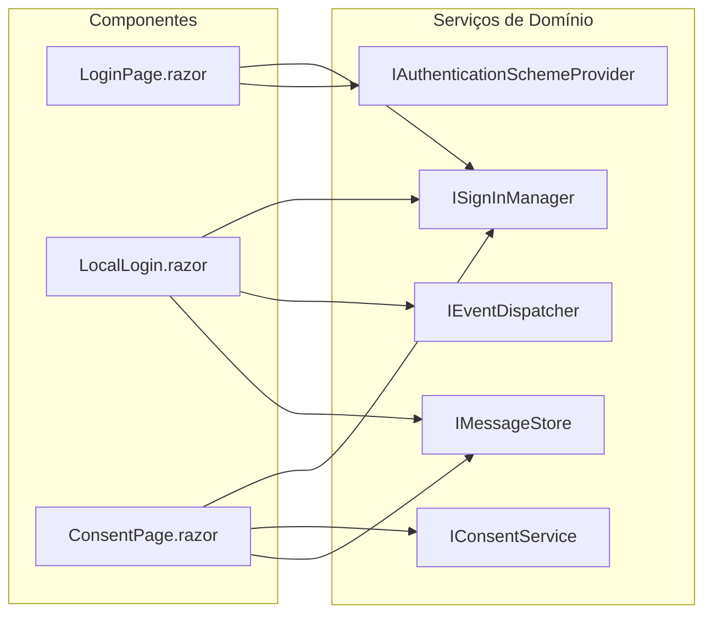
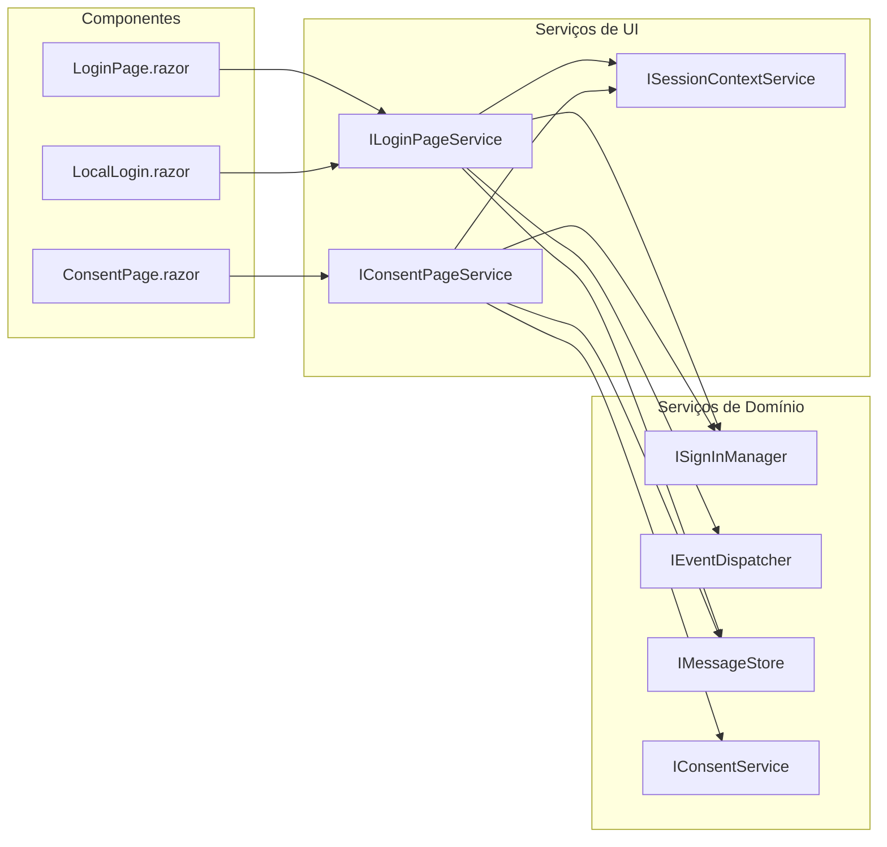
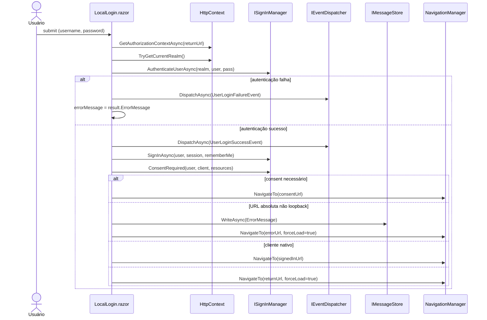
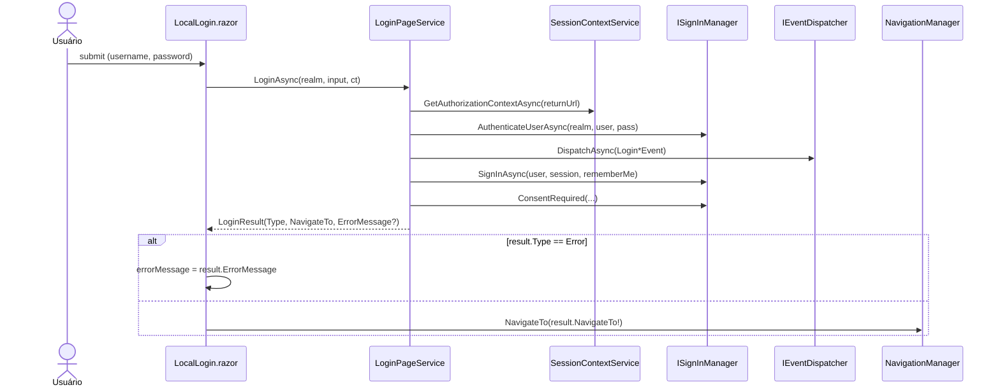
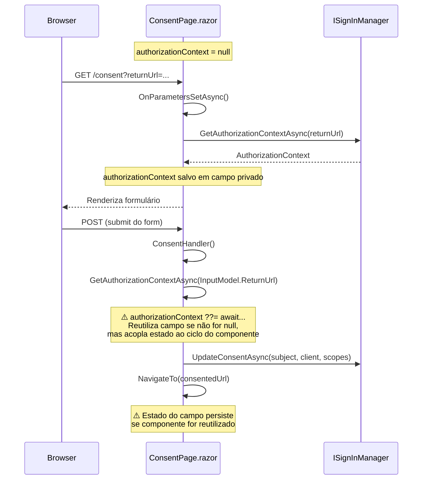
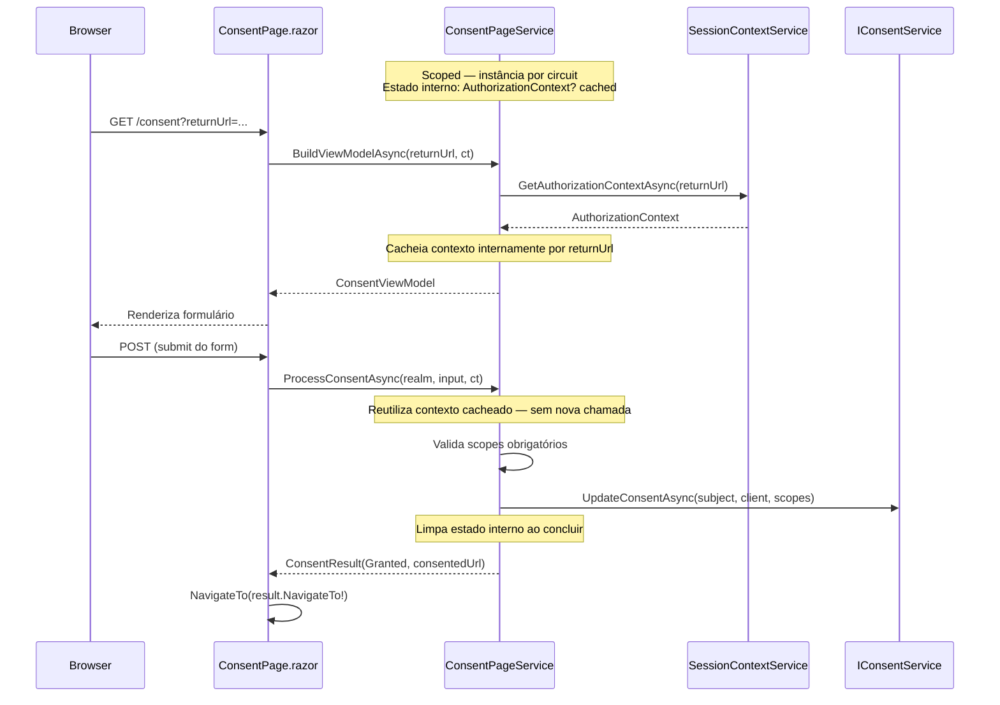
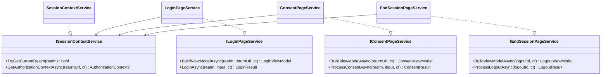
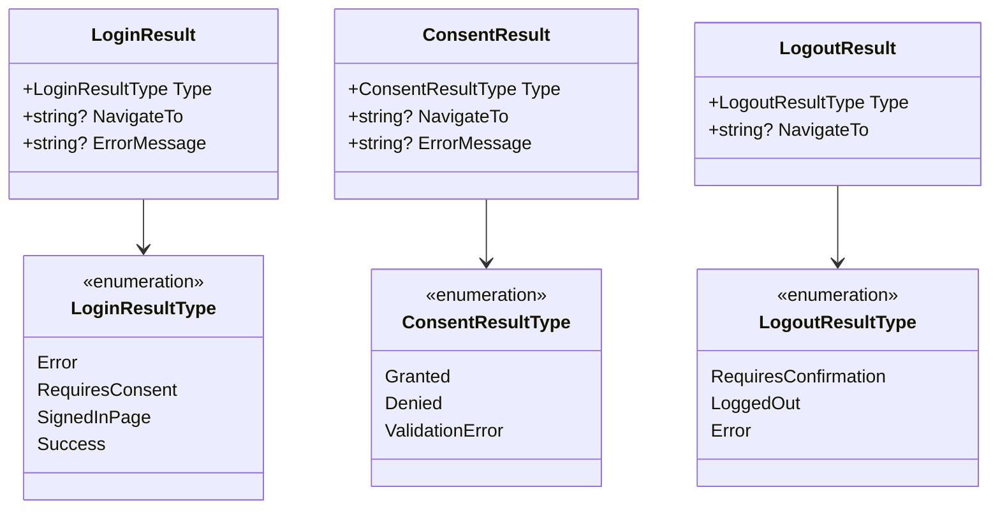

# Plan: UI Screens Refactoring

## Status: PENDING

## Context

`RoyalIdentity.Razor` contém os componentes Blazor Server para os fluxos de autenticação. O problema identificado: lógica de negócio e coordenação de fluxo estão implementadas diretamente nos componentes `.razor`, em vez de em serviços injetáveis.

Evidência concreta lida no código:

**`LocalLogin.razor` — `LoginUser()` faz tudo:**
- Busca contexto de autorização via `HttpContext.GetAuthorizationContextAsync()`
- Resolve realm a partir do contexto ou do HttpContext
- Chama `SignInManager.AuthenticateUserAsync()` (valida credencial)
- Dispatcha eventos de sucesso/falha
- Chama `SignInManager.SignInAsync()` (cria sessão)
- Chama `SignInManager.ConsentRequired()` (verifica consentimento)
- Toma decisão de navegação (consent URL vs signed-in URL vs return URL vs error URL)
- Lida com URLs absolutas vs relativas vs loopback
- Escreve mensagens de erro no `IMessageStore`

**`ConsentPage.razor` — implementa lógica de consentimento diretamente:**
- `GetAuthorizationContextAsync()` implementado no componente
- `CreateConsentViewModel()` no componente
- Validação de scopes obrigatórios no componente
- Construção de `ConsentedScope` objects no componente
- Chamada ao `ConsentService.UpdateConsentAsync()` no componente

**`LoginPage.razor` — coordena providers no `OnParametersSetAsync`:**
- Resolve realm
- Busca contexto de autorização
- Busca todos os schemes de autenticação
- Filtra providers externos por restrições do client
- Aplica configurações de realm (`AllowLocalLogin`)

---

## Visão Geral: Dependências Antes vs Depois

### Antes — Componentes acoplados diretamente aos serviços de domínio



### Depois — Componentes falam apenas com serviços de UI



---

## Objetivo

Extrair toda lógica de coordenação, validação e tomada de decisão dos componentes para serviços de UI testáveis. Os componentes devem apenas:

1. Receber parâmetros / estado de rota
2. Invocar um método de serviço
3. Renderizar o model retornado ou responder à navegação indicada pelo serviço

---

## Serviços a Criar

### `ILoginPageService`

Responsabilidade: preparar o model para a página de login e processar o submit de credenciais.

```csharp
public interface ILoginPageService
{
    // Chamado em OnParametersSetAsync
    Task<LoginViewModel> BuildViewModelAsync(string realm, string? returnUrl, CancellationToken ct);

    // Chamado no submit do form
    Task<LoginResult> LoginAsync(string realm, LoginInput input, CancellationToken ct);
}

public record LoginResult(
    LoginResultType Type,
    string? NavigateTo = null,
    string? ErrorMessage = null
);

public enum LoginResultType
{
    Error,          // mostrar errorMessage
    RequiresConsent,// navegar para ConsentUrl
    SignedInPage,   // navegar para SignedInUrl (clientes nativos)
    Success         // navegar para ReturnUrl / ProfileUrl
}
```

#### Fluxo de Login — Antes



#### Fluxo de Login — Depois



**Implementação encapsula:**
- Busca do contexto de autorização via `ISessionContextService`
- Resolução do realm
- `SignInManager.AuthenticateUserAsync()`
- `EventDispatcher.DispatchAsync()` (sucesso e falha)
- `SignInManager.SignInAsync()`
- `SignInManager.ConsentRequired()`
- Toda lógica de decisão de URL (native client vs web client, absolute vs relative)
- Escrita de erro em `IMessageStore`

---

### `IConsentPageService`

Responsabilidade: preparar model de consentimento e processar a decisão do usuário.

```csharp
public interface IConsentPageService
{
    Task<ConsentViewModel> BuildViewModelAsync(string? returnUrl, CancellationToken ct);

    Task<ConsentResult> ProcessConsentAsync(
        string realm,
        ConsentInput input,
        CancellationToken ct);
}

public record ConsentResult(
    ConsentResultType Type,
    string? NavigateTo = null,
    string? ErrorMessage = null
);

public enum ConsentResultType
{
    Granted,        // navegar para ConsentedUrl
    Denied,         // navegar para erro ou returnUrl com access_denied
    ValidationError // mostrar errorMessage, re-renderizar form
}
```

#### Problema de Estado no ConsentPage — Antes

O componente atual cacheia `AuthorizationContext` como campo privado com lazy init. O fluxo multi-render é frágil:



#### Fluxo de Consentimento — Depois

`ConsentPageService` é `Scoped` (vive pelo SignalR circuit), gerencia o cache internamente e limpa o estado ao concluir o fluxo:



**Implementação encapsula:**
- `SignInManager.GetAuthorizationContextAsync()`
- Criação de `ConsentViewModel` a partir do contexto
- Validação de scopes obrigatórios
- Construção de `ConsentedScope` list
- `ConsentService.UpdateConsentAsync()`
- Tratamento do caso "contexto não encontrado" (navega para error URL)
- Limpeza de estado interno ao concluir

---

### `IEndSessionPageService`

Responsabilidade: preparar e processar o fluxo de logout (3 fases: confirmação → processamento → conclusão).

```csharp
public interface IEndSessionPageService
{
    Task<LogoutViewModel> BuildViewModelAsync(string? logoutId, CancellationToken ct);
    Task<LogoutResult> ProcessLogoutAsync(string? logoutId, CancellationToken ct);
}
```

> Assinatura detalhada a ser definida após leitura de `LogoutPage.razor`, `LoggingOutPage.razor`, `LoggedOutPage.razor` na Fase 1.

---

### `ISessionContextService` (transversal)

Encapsula o padrão repetido de resolução de realm + contexto de autorização, que hoje está duplicado em `LoginPage`, `LocalLogin`, `ConsentPage`, e `LogoutPage`.

```csharp
public interface ISessionContextService
{
    // Resolve realm do HttpContext atual
    bool TryGetCurrentRealm(out Realm realm);

    // Busca AuthorizationContext para um returnUrl
    Task<AuthorizationContext?> GetAuthorizationContextAsync(string? returnUrl, CancellationToken ct);
}
```

---

## Estrutura dos Novos Tipos

### Interfaces de Serviço e Implementações



### Tipos de Resultado



---

## Estrutura de Arquivos Proposta

```
RoyalIdentity.Razor/
  Services/
    ISessionContextService.cs       ← novo
    SessionContextService.cs        ← novo
    ILoginPageService.cs            ← novo
    LoginPageService.cs             ← novo
    IConsentPageService.cs          ← novo
    ConsentPageService.cs           ← novo
    IEndSessionPageService.cs       ← novo
    EndSessionPageService.cs        ← novo
    IdentityRedirectManager.cs      ← existente
    IdentityRevalidatingAuthenticationStateProvider.cs ← existente
    IdentityUserManager.cs          ← existente
  ViewModels/
    LoginViewModel.cs               ← mover (hoje junto ao componente)
    LoginInput.cs                   ← mover
    LoginResult.cs                  ← novo
    ConsentViewModel.cs             ← mover
    ConsentInput.cs                 ← mover
    ConsentResult.cs                ← novo
    LogoutViewModel.cs              ← mover
    LogoutResult.cs                 ← novo
```

---

## Passos de Execução

### Fase 1 — Auditoria dos componentes atuais

1. Ler todos os `.razor` em `Components/Account/` e mapear: quais serviços são injetados, qual lógica está no `@code`, quais ViewModels existem e onde.
2. Localizar ViewModels e InputModels (estão no mesmo arquivo `.razor` ou em arquivos separados?).
3. Mapear todos os lugares onde `HttpContext.GetAuthorizationContextAsync()` e `TryGetCurrentRealm()` são chamados.
4. Ler `LogoutPage.razor`, `LoggingOutPage.razor`, `LoggedOutPage.razor` para detalhar a assinatura de `IEndSessionPageService`.

### Fase 2 — Criar `ISessionContextService`

1. Criar interface e implementação.
2. Registrar no DI como `Scoped`.
3. Substituir o padrão direto nos componentes pela injeção do serviço.
4. Build + verificar comportamento.

### Fase 3 — Extrair `ILoginPageService`

1. Criar interface com `BuildViewModelAsync` e `LoginAsync`.
2. Mover lógica de `LoginPage.OnParametersSetAsync` para `BuildViewModelAsync`.
3. Mover lógica de `LocalLogin.LoginUser()` para `LoginAsync`.
4. Criar `LoginResult` e `LoginResultType`.
5. Simplificar `LoginPage.razor` e `LocalLogin.razor`.
6. Registrar `LoginPageService` no DI.
7. Verificar comportamento end-to-end.

### Fase 4 — Extrair `IConsentPageService`

1. Criar interface com `BuildViewModelAsync` e `ProcessConsentAsync`.
2. Mover lógica de `ConsentPage.OnParametersSetAsync` e `ConsentHandler` para o serviço.
3. Garantir que o serviço gerencia o caching do `AuthorizationContext` e limpa ao concluir.
4. Simplificar `ConsentPage.razor`.
5. Registrar no DI como `Scoped`.
6. Verificar comportamento.

### Fase 5 — Extrair lógica de Logout

1. Analisar os três componentes do fluxo de logout (resultado da Fase 1).
2. Criar `IEndSessionPageService` com assinatura final.
3. Simplificar os componentes de logout.

### Fase 6 — Mover ViewModels para pasta dedicada

1. Criar `RoyalIdentity.Razor/ViewModels/`.
2. Mover todas as classes de model que hoje estão junto aos componentes.
3. Atualizar namespaces e `_Imports.razor`.

---

## Regras para os Componentes Após Refatoração

1. **Injeções proibidas** nos componentes: `ISignInManager`, `IEventDispatcher`, `IMessageStore`, `IConsentService` — esses são injetados apenas nos serviços de UI.
2. **Injeções permitidas**: serviços de UI (`ILoginPageService`, etc.), `NavigationManager`, `ILogger<T>`.
3. **`HttpContext` como `[CascadingParameter]`** pode permanecer para leitura de realm, mas toda lógica de extração passa pelo `ISessionContextService`.
4. **Nenhuma decisão de navegação no componente** além de `NavigationManager.NavigateTo(result.NavigateTo!)`. O serviço decide o destino; o componente executa.
5. **Nenhuma lógica de validação** (scopes obrigatórios, URL válida, etc.) no componente.

---

## Tratamento de Sessão e Estado entre Renders

`IConsentPageService` deve ser registrado como `Scoped`. Em Blazor Server, `Scoped` vive pelo tempo do SignalR circuit — não do HTTP request. Isso é intencional: permite reutilizar o `AuthorizationContext` entre o GET e o POST do formulário de consent sem nova chamada ao store.

**Contrato de ciclo de vida do serviço:**
- Ao receber `BuildViewModelAsync` → carrega e cacheia `AuthorizationContext`
- Ao receber `ProcessConsentAsync` → usa contexto cacheado, limpa ao concluir
- Se o circuit for descartado antes de concluir → o contexto cacheado é liberado com o serviço

O mesmo vale para `IEndSessionPageService` se o fluxo de logout tiver múltiplos passos (confirmação → processamento).

---

## Riscos

- **Blazor Server vs SSR**: Verificar quais componentes usam SSR (`@rendermode` não definido) vs `InteractiveServer`. Componentes SSR recebem novo `HttpContext` a cada request — não há circuit. O serviço de UI deve funcionar nos dois modos; se for SSR puro, o caching por circuit não se aplica.
- **Escrita de cookies em componentes interativos**: `SignInManager.SignInAsync()` escreve cookies via `HttpContext.Response`. Após a primeira renderização interativa, o `HttpContext` pode não estar disponível para escrita. Isso pode ser um bug latente que a extração para serviço vai expor — investigar durante a Fase 3.
- **`NavigationManager.NavigateTo` em Blazor Server**: pode lançar `NavigationException` internamente (é o mecanismo de redirecionamento). Não capturar essa exceção nos serviços — deixar propagar normalmente.
