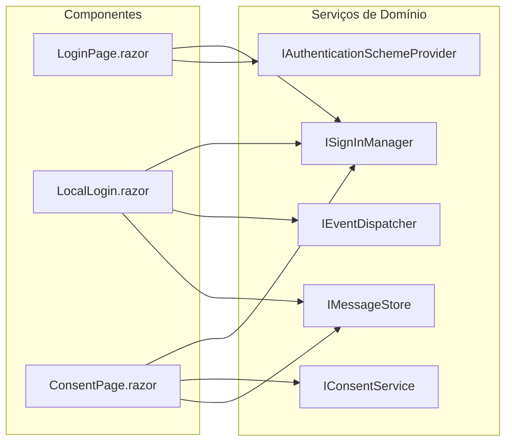
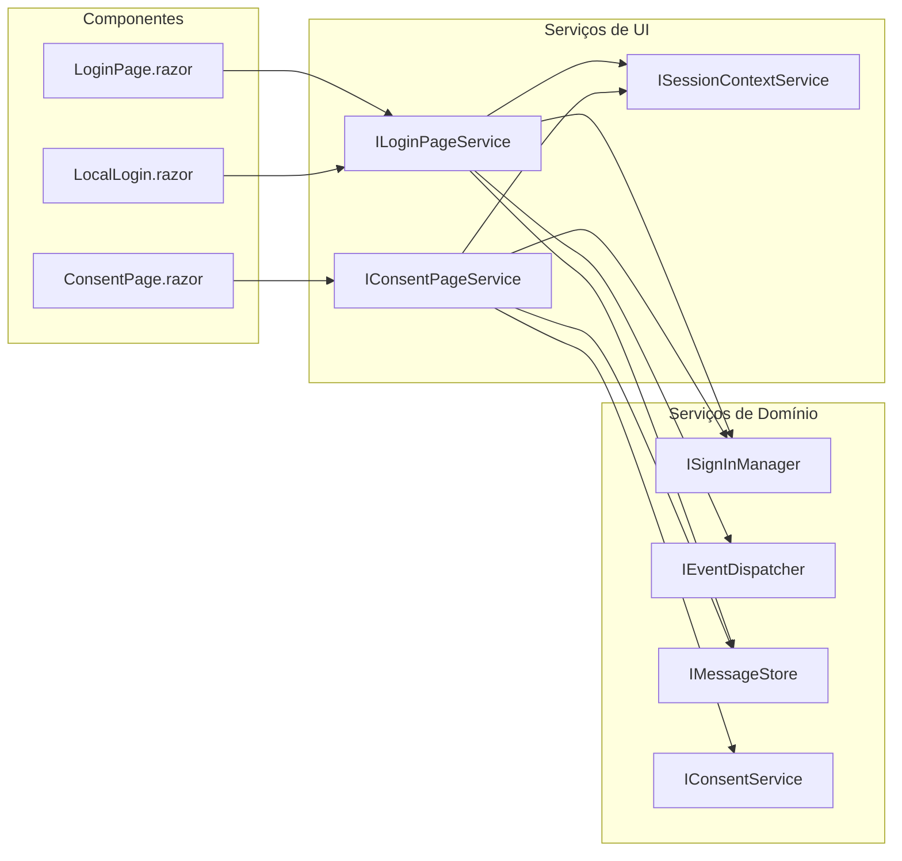
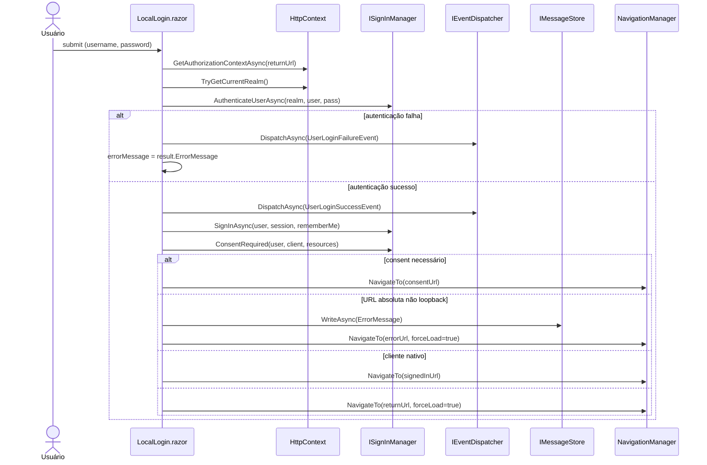
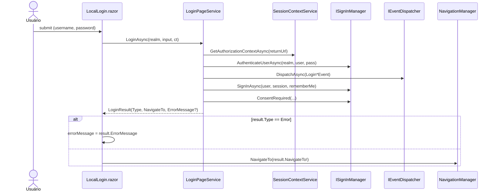
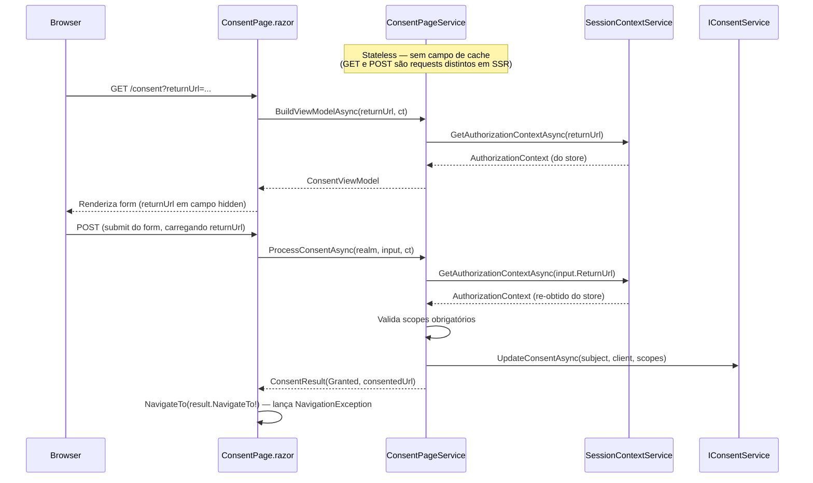
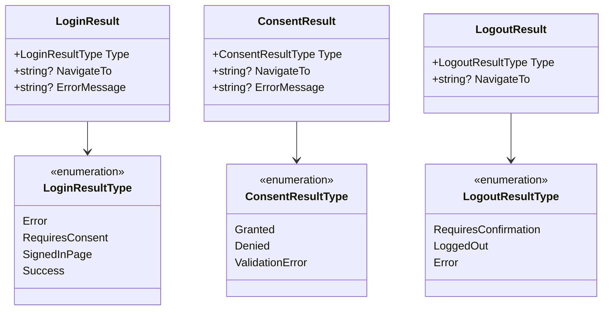

# Plan: UI Screens Refactoring

## Status: COMPLETED

## Progresso

`██████████` **100%** — 6 de 6 fases concluídas

## Ordem de execução (global)

Os três planos rodam **um por vez, cada um 100% completo antes do próximo**:

1. Constantes (`plan-constants-refactoring.md`)
2. Contextos (`plan-contexts-redesign.md`)
3. **UI** ← este plano

## Modo de Renderização: SSR estático (não Blazor Server interativo)

> **Premissa corrigida — ler antes de tudo.** As páginas de account rodam em **Static Server Rendering (SSR)**, *não* em circuit interativo. Confirmado em [`App.razor`](../../RoyalIdentity.Server/Components/App.razor):
>
> ```csharp
> private IComponentRenderMode? RenderModeForPage => HttpContext.IsAccountPages() ? null : InteractiveServer;
> ```
>
> `IsAccountPages()` ([`RoyalIdentityHttpContextExtensions.cs`](../../RoyalIdentity.Razor/Extensions/RoyalIdentityHttpContextExtensions.cs)) é true para qualquer rota `{realm}/account/*` → render mode **`null`** (SSR). Só rotas não-account usam `InteractiveServer`.
>
> **Evidências no código** (todos os componentes de account): `method="post"` + `[SupplyParameterFromForm]` + `FormName`, `[CascadingParameter] HttpContext`, e estado passado via `IMessageStore`/query string/campos de form — **nunca** via campo de componente entre requests.
>
> **Consequências para este plano (todas tratadas abaixo):**
> 1. **Não há circuit SignalR.** `Scoped` = tempo de vida do **request HTTP**, não de um circuit. GET e POST são requests distintos → instâncias de serviço distintas.
> 2. **Não existe "cache entre renders".** O `AuthorizationContext` deve ser **re-obtido do store a cada request** (idempotente via `returnUrl`/`authzId`). O `??=` atual só evita uma 2ª chamada **dentro do mesmo request**.
> 3. **`HttpContext` está disponível** durante o request → escrever cookies/headers funciona. O risco real é o inverso: **não** migrar estas páginas para `InteractiveServer` sem repensar tudo.
> 4. **`NavigationManager.NavigateTo` lança `NavigationException`** e **não retorna** ao método — é o mecanismo de redirect do SSR, não um bug. Os serviços **não** devem capturá-la.

## Context

`RoyalIdentity.Razor` contém os componentes Razor (renderizados em **SSR** para as account pages — ver "Modo de Renderização") para os fluxos de autenticação. O problema identificado: lógica de negócio e coordenação de fluxo estão implementadas diretamente nos componentes `.razor`, em vez de em serviços injetáveis.

Evidência concreta lida no código:

**`LocalLogin.razor` — `LoginUser()` faz tudo:**
- Busca contexto de autorização via `HttpContext.GetAuthorizationContextAsync()`
- Resolve realm a partir do contexto ou do HttpContext
- Chama `SignInManager.AuthenticateUserAsync()` (valida credencial)
- Dispatcha eventos de sucesso/falha
- Chama `SignInManager.SignInAsync()` (cria sessão)
- Chama `SignInManager.ConsentRequired()` (verifica consentimento)
- Toma decisão de navegação (consent URL vs signed-in URL vs return URL vs error URL)
- Lida com URLs absolutas vs relativas vs loopback
- Escreve mensagens de erro no `IMessageStore`

**`ConsentPage.razor` — implementa lógica de consentimento diretamente:**
- `GetAuthorizationContextAsync()` implementado no componente
- `CreateConsentViewModel()` no componente
- Validação de scopes obrigatórios no componente
- Construção de `ConsentedScope` objects no componente
- Chamada ao `ConsentService.UpdateConsentAsync()` no componente

**`LoginPage.razor` — coordena providers no `OnParametersSetAsync`:**
- Resolve realm
- Busca contexto de autorização
- Busca todos os schemes de autenticação
- Filtra providers externos por restrições do client
- Aplica configurações de realm (`AllowLocalLogin`)

---

## Visão Geral: Dependências Antes vs Depois

### Antes — Componentes acoplados diretamente aos serviços de domínio



### Depois — Componentes falam apenas com serviços de UI



---

## Objetivo

Extrair toda lógica de coordenação, validação e tomada de decisão dos componentes para serviços de UI testáveis. Os componentes devem apenas:

1. Receber parâmetros / estado de rota
2. Invocar um método de serviço
3. Renderizar o model retornado ou responder à navegação indicada pelo serviço

---

## Serviços a Criar

### `ILoginPageService`

Responsabilidade: preparar o model para a página de login e processar o submit de credenciais.

```csharp
public interface ILoginPageService
{
    // Chamado em OnParametersSetAsync
    Task<LoginViewModel> BuildViewModelAsync(string realm, string? returnUrl, CancellationToken ct);

    // Chamado no submit do form
    Task<LoginResult> LoginAsync(string realm, LoginInput input, CancellationToken ct);
}

public record LoginResult(
    LoginResultType Type,
    string? NavigateTo = null,
    string? ErrorMessage = null
);

public enum LoginResultType
{
    Error,          // mostrar errorMessage
    RequiresConsent,// navegar para ConsentUrl
    SignedInPage,   // navegar para SignedInUrl (clientes nativos)
    Success         // navegar para ReturnUrl / ProfileUrl
}
```

#### Fluxo de Login — Antes



#### Fluxo de Login — Depois



**Implementação encapsula:**
- Busca do contexto de autorização via `ISessionContextService`
- Resolução do realm
- `SignInManager.AuthenticateUserAsync()`
- `EventDispatcher.DispatchAsync()` (sucesso e falha)
- `SignInManager.SignInAsync()`
- `SignInManager.ConsentRequired()`
- Toda lógica de decisão de URL (native client vs web client, absolute vs relative)
- Escrita de erro em `IMessageStore`

---

### `IConsentPageService`

Responsabilidade: preparar model de consentimento e processar a decisão do usuário.

```csharp
public interface IConsentPageService
{
    Task<ConsentViewModel> BuildViewModelAsync(string? returnUrl, CancellationToken ct);

    Task<ConsentResult> ProcessConsentAsync(
        string realm,
        ConsentInput input,
        CancellationToken ct);
}

public record ConsentResult(
    ConsentResultType Type,
    string? NavigateTo = null,
    string? ErrorMessage = null
);

public enum ConsentResultType
{
    Granted,        // navegar para ConsentedUrl
    Denied,         // navegar para erro ou returnUrl com access_denied
    ValidationError // mostrar errorMessage, re-renderizar form
}
```

#### Problema de Estado no ConsentPage — Antes (em SSR)

O componente cacheia `AuthorizationContext` num campo privado com `??=`. Em SSR isso é **inócuo entre requests** (cada request instancia um componente novo, campo sempre `null` no início) — o `??=` só evita a 2ª chamada **dentro** do POST (`OnParametersSetAsync` + `ConsentHandler`). O problema real: a lógica de obtenção/validação/persistência está toda no componente, misturada ao ciclo de render, e dificulta teste.

```mermaid
sequenceDiagram
    participant B as Browser
    participant CP as ConsentPage.razor
    participant SIM as ISignInManager

    Note over CP: GET — nova instância, campo = null

    B->>CP: GET /consent?returnUrl=...
    CP->>CP: OnParametersSetAsync()
    CP->>SIM: GetAuthorizationContextAsync(returnUrl)
    SIM-->>CP: AuthorizationContext (do store)
    CP-->>B: Renderiza formulário

    Note over CP: POST — OUTRA instância, campo = null de novo

    B->>CP: POST (submit do form)
    CP->>CP: OnParametersSetAsync() → GetAuthorizationContextAsync(returnUrl)
    CP->>CP: ConsentHandler() → GetAuthorizationContextAsync(InputModel.ReturnUrl)
    Note over CP: ⚠️ ??= só evita a 2ª chamada DESTE request;<br/>nada é reutilizado do GET (request anterior)

    CP->>SIM: UpdateConsentAsync(subject, client, scopes)
    CP->>CP: NavigateTo(consentedUrl) — lança NavigationException
```

#### Fluxo de Consentimento — Depois (SSR)

`ConsentPageService` é **stateless** (registrar como `Scoped`; em SSR vive só pelo request). Cada request **re-obtém** o `AuthorizationContext` do store via `returnUrl` — **não há cache entre GET e POST** porque são requests distintos:



> O `returnUrl` (campo hidden no form) transporta a identidade da requisição entre GET e POST. O store (via `GetAuthorizationContextAsync`) é a fonte de verdade idempotente — re-obter é barato e correto. Isso elimina o `authorizationContext ??=` frágil do componente atual.

**Implementação encapsula:**
- `SignInManager.GetAuthorizationContextAsync()` (re-obtido a cada request)
- Criação de `ConsentViewModel` a partir do contexto
- Validação de scopes obrigatórios
- Construção de `ConsentedScope` list
- `ConsentService.UpdateConsentAsync()`
- Tratamento do caso "contexto não encontrado" (navega para error URL)

---

### `IEndSessionPageService`

Responsabilidade: preparar e processar o fluxo de logout. Mapeamento das 3 telas (já lidas):

| Tela | Rota | Hoje faz | Serviços usados |
|---|---|---|---|
| `LogoutPage` | `Logout` | GET: cria `logoutId` se ausente (`CreateLogoutIdAsync`), lê `LogoutMessage`; se `ShowSignoutPrompt` → prompt, senão sign-out direto. POST: valida `ConfirmedId`, sign-out. | `ISignOutManager`, `IMessageStore` |
| `LoggingOutPage` | `LoggingOut` | GET: lê `LogoutCallbackMessage`; renderiza `<iframe>` de front-channel logout + link de redirect. | `IMessageStore` |
| `LoggedOutPage` | `LoggedOut` | Estático (apenas mensagem). | — (nenhum; **não precisa de serviço**) |

Assinatura proposta (cobre confirmação + sign-out + processamento de callback):

```csharp
public interface IEndSessionPageService
{
    // LogoutPage GET — decide entre mostrar prompt ou efetuar sign-out direto
    Task<LogoutResult> BeginLogoutAsync(string? logoutId, CancellationToken ct);

    // LogoutPage POST — confirma e efetua o sign-out
    Task<LogoutResult> ConfirmLogoutAsync(string confirmedId, CancellationToken ct);

    // LoggingOutPage GET — monta o model de processamento (front-channel iframe + redirect)
    Task<LoggingOutViewModel> BuildLoggingOutAsync(string? logoutId, CancellationToken ct);
}
```

`LogoutResult.Type` cobre: `RequiresConfirmation` (renderiza prompt), `LoggedOut`/redirect (navega para a URI de sign-out), `Error` (navega para error URL). O caso "model nulo / logoutId ausente" → `Error`. `LoggedOutPage` permanece sem serviço.

---

### `ISessionContextService` (transversal)

Encapsula o padrão repetido de resolução de realm + contexto de autorização, que hoje está duplicado em `LoginPage`, `LocalLogin`, `ConsentPage`, e `LogoutPage`.

```csharp
public interface ISessionContextService
{
    // Resolve realm do HttpContext atual
    bool TryGetCurrentRealm(out Realm realm);

    // Busca AuthorizationContext para um returnUrl
    Task<AuthorizationContext?> GetAuthorizationContextAsync(string? returnUrl, CancellationToken ct);
}
```

> **Origem do `HttpContext` (decisão de design necessária).** Hoje `TryGetCurrentRealm` e `GetAuthorizationContextAsync` são *extension methods* sobre `HttpContext`, que os componentes recebem via `[CascadingParameter] HttpContext`. Movê-los para um serviço exige uma fonte de `HttpContext`. Duas opções:
>
> 1. **`IHttpContextAccessor`** injetado no `SessionContextService` (funciona em SSR, pois os componentes rodam dentro do pipeline do request). Preferível — mantém a assinatura dos métodos limpa.
> 2. **Passar `HttpContext` por parâmetro** em cada método (o componente repassa seu `[CascadingParameter]`). Mais explícito, porém verboso.
>
> Recomendação: **opção 1** (`IHttpContextAccessor`), registrando `AddHttpContextAccessor()` se ainda não estiver. Validar em SSR que `accessor.HttpContext` não é nulo durante o render das account pages.

---

## Estrutura dos Novos Tipos

### Interfaces de Serviço e Implementações


### Tipos de Resultado



---

## Estrutura de Arquivos Proposta

```
RoyalIdentity.Razor/
  Services/
    ISessionContextService.cs       ← novo
    SessionContextService.cs        ← novo
    ILoginPageService.cs            ← novo
    LoginPageService.cs             ← novo
    IConsentPageService.cs          ← novo
    ConsentPageService.cs           ← novo
    IEndSessionPageService.cs       ← novo
    EndSessionPageService.cs        ← novo
    IdentityRedirectManager.cs      ← existente
    IdentityRevalidatingAuthenticationStateProvider.cs ← existente
    IdentityUserManager.cs          ← existente
  ViewModels/
    LoginViewModel.cs               ← mover (já é .cs irmão do .razor)
    LoginInputModel.cs              ← mover (nome real: ...InputModel, não ...Input)
    LoginResult.cs                  ← novo
    ConsentViewModel.cs             ← mover
    ConsentInputModel.cs            ← mover
    ConsentResult.cs                ← novo
    LogoutInputModel.cs             ← mover (confirmar arquivo na Fase 1)
    LogoutViewModel.cs              ← novo (model do prompt de confirmação)
    LoggingOutViewModel.cs         ← novo (model da tela de processamento/front-channel)
    LogoutResult.cs                 ← novo
```

> **Nomenclatura real**: o código usa o sufixo **`InputModel`** (`LoginInputModel`, `ConsentInputModel`, `LogoutInputModel`), não `Input`. Os ViewModels/InputModels **já são arquivos `.cs` separados** na pasta do componente (não estão embutidos no `.razor`). Portanto a Fase 6 é **reorganização de pasta + ajuste de namespace/`_Imports.razor`**, não extração de código de dentro do `.razor`.

---

## Passos de Execução

### Fase 1 — Auditoria dos componentes atuais

1. Ler todos os `.razor` em `Components/Account/` e mapear: quais serviços são injetados, qual lógica está no `@code`, quais ViewModels existem e onde.
2. ~~Localizar ViewModels e InputModels~~ — **já confirmado: arquivos `.cs` separados** na pasta de cada componente (`LoginViewModel.cs`, `LoginInputModel.cs`, `ConsentViewModel.cs`, `ConsentInputModel.cs`, …), não embutidos no `.razor`.
3. Mapear todos os lugares onde `HttpContext.GetAuthorizationContextAsync()` e `TryGetCurrentRealm()` são chamados (hoje: `LoginPage`, `LocalLogin`, `ConsentPage`, `SignedIn`).
4. ~~Ler os componentes de logout~~ — **já lido**; assinatura de `IEndSessionPageService` detalhada acima. Confirmar apenas o arquivo de `LogoutInputModel`.
5. **Confirmar o render mode** de cada página de account = SSR (`null`) — já validado em `App.razor` + `IsAccountPages()`. Garante que o design stateless é o correto.

### Fase 2 — Criar `ISessionContextService`

1. Criar interface e implementação (obtém `HttpContext` via `IHttpContextAccessor` — ver nota em "ISessionContextService").
2. Registrar no DI como `Scoped`; garantir `AddHttpContextAccessor()` no host.
3. Substituir o padrão direto nos componentes pela injeção do serviço.
4. Build + verificar comportamento (validar `accessor.HttpContext` não-nulo em SSR).

### Fase 3 — Extrair `ILoginPageService`

1. Criar interface com `BuildViewModelAsync` e `LoginAsync`.
2. Mover lógica de `LoginPage.OnParametersSetAsync` para `BuildViewModelAsync`.
3. Mover lógica de `LocalLogin.LoginUser()` para `LoginAsync`.
4. Criar `LoginResult` e `LoginResultType`.
5. Simplificar `LoginPage.razor` e `LocalLogin.razor`.
6. Registrar `LoginPageService` no DI.
7. Verificar comportamento end-to-end.

### Fase 4 — Extrair `IConsentPageService`

1. Criar interface com `BuildViewModelAsync` e `ProcessConsentAsync`.
2. Mover lógica de `ConsentPage.OnParametersSetAsync` e `ConsentHandler` para o serviço.
3. O serviço é **stateless**: `ProcessConsentAsync` **re-obtém** o `AuthorizationContext` do store via `input.ReturnUrl` (não cachear entre requests — SSR não tem circuit). Eliminar o `authorizationContext ??=` do componente.
4. Simplificar `ConsentPage.razor`.
5. Registrar no DI como `Scoped` (= por request em SSR).
6. Verificar comportamento.

### Fase 5 — Extrair lógica de Logout

1. Analisar os três componentes do fluxo de logout (resultado da Fase 1).
2. Criar `IEndSessionPageService` com assinatura final.
3. Simplificar os componentes de logout.

### Fase 6 — Mover ViewModels para pasta dedicada

1. Criar `RoyalIdentity.Razor/ViewModels/`.
2. Mover os arquivos `.cs` de model que hoje vivem na pasta de cada componente (`LoginViewModel.cs`, `LoginInputModel.cs`, `ConsentViewModel.cs`, `ConsentInputModel.cs`, `LogoutInputModel.cs`, …) — eles **já são arquivos separados**, então é mover + renomear namespace, não extrair de dentro do `.razor`.
3. Atualizar namespaces e `_Imports.razor`.

---

## Regras para os Componentes Após Refatoração

1. **Injeções proibidas** nos componentes: `ISignInManager`, `IEventDispatcher`, `IMessageStore`, `IConsentService` — esses são injetados apenas nos serviços de UI.
2. **Injeções permitidas**: serviços de UI (`ILoginPageService`, etc.), `NavigationManager`, `ILogger<T>`.
3. **`HttpContext` como `[CascadingParameter]`** pode permanecer para leitura de realm, mas toda lógica de extração passa pelo `ISessionContextService`.
4. **Nenhuma decisão de navegação no componente** além de `NavigationManager.NavigateTo(result.NavigateTo!)`. O serviço decide o destino; o componente executa.
5. **Nenhuma lógica de validação** (scopes obrigatórios, URL válida, etc.) no componente.

---

## Tratamento de Estado entre Requests (SSR)

Em SSR **não há circuit** — cada request HTTP (GET do form, POST do submit) cria um novo escopo de DI. Portanto **não depender de cache em campo de serviço entre requests**. O estado é transportado por:

- **`returnUrl`/`logoutId`** (campo hidden no form / query string) — identifica a requisição;
- **Store** (`IMessageStore`, `IAuthorizeParametersStore` via `GetAuthorizationContextAsync`) — fonte de verdade idempotente, re-consultada a cada request;
- **Campos `[SupplyParameterFromForm]`** — dados do próprio submit.

**Contrato de ciclo de vida dos serviços de UI (SSR):**
- `Scoped` = tempo do **request** (não de circuit). Os serviços são efetivamente **stateless** entre requests.
- `BuildViewModelAsync` → obtém o contexto do store e monta o view model.
- `ProcessConsentAsync`/`ProcessLogoutAsync` → **re-obtêm** o contexto do store (via `returnUrl`/`logoutId`), validam e persistem.
- Nenhuma limpeza de cache é necessária — não há cache cross-request.

> **Se um dia as páginas migrarem para `InteractiveServer`** (circuit), este contrato muda: `Scoped` passaria a viver pelo circuit e o cache cross-render voltaria a ser possível — mas aí o `HttpContext` deixa de estar disponível para escrita de cookies, exigindo redesenho do sign-in/sign-out. **Não** assumir esse modo sem revisão.

---

## Riscos

- **SSR confirmado (não interativo)**: as account pages usam render mode `null` (ver "Modo de Renderização" no topo). Logo, **sem circuit**, `Scoped` = por request, e **cache cross-render não existe** — os serviços são stateless e re-consultam o store. Este foi o principal ajuste de premissa do plano.
- **Escrita de cookies**: `SignInManager.SignInAsync()` escreve cookies via `HttpContext.Response`. Em SSR isso **funciona** (o `HttpContext` está disponível durante o render). O risco é o oposto do imaginado: **migrar estas páginas para `InteractiveServer` quebraria** a escrita de cookies — não fazer isso sem redesenhar o sign-in/sign-out.
- **`NavigationManager.NavigateTo` em SSR**: lança `NavigationException` e **não retorna** ao método chamador — é o mecanismo de redirect (comportamento esperado, **não** é bug de fall-through). Os serviços **não** devem capturá-la; o componente chama `NavigateTo(result.NavigateTo!)` como passo final.
- **Validação do `IHttpContextAccessor` em SSR**: confirmar que `accessor.HttpContext` é não-nulo durante o render das account pages (ver `ISessionContextService`). Se houver qualquer caminho interativo, tratar o nulo.
