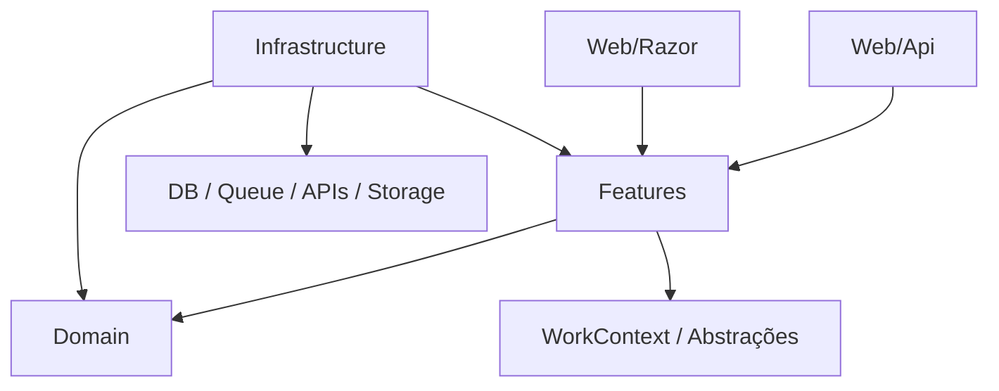

# Arquitetura Modular DDD + Hexagonal Pragmática + Vertical Feature Slices

**Versão:** 0.1  
**Formato:** artigo/tutorial de referência  
**Contexto:** arquitetura .NET/C# modular, pragmática, orientada a domínio, features, produtividade e agentes de IA.

---

## 1. Visão geral

Esta arquitetura combina quatro ideias principais:

1. **Modularidade por domínio**  
   O sistema é dividido em módulos de negócio. Cada módulo representa, idealmente, um **Bounded Context** do DDD ou uma capability de negócio suficientemente autônoma.

2. **DDD no núcleo interno**  
   Cada módulo possui um núcleo interno composto por **Domain** e **Features**.  
   `Domain` concentra regras, entidades, value objects, eventos e serviços de domínio.  
   `Features` concentra casos de uso, comandos, queries, contratos operacionais, modelos de entrada/saída, filtros, validações e metadados pragmáticos da funcionalidade.

3. **Hexagonal Architecture como princípio, não como nomenclatura física**  
   A arquitetura usa os conceitos de interno/externo, entrada/saída e inversão de dependência, mas evita nomes físicos como `Ports`, `Driving`, `Driven` e `Adapters`.  
   Esses termos servem para pensar a arquitetura, não para poluir a navegação do projeto.

4. **Vertical Application Slices**  
   O sistema é implementado por features/casos de uso. Uma feature deve manter próximos os artefatos que mudam juntos: comando/query, modelo de entrada, modelo de saída, validação, filtros, metadados de endpoint e, quando adequado, mapeamento HTTP.

Uma descrição curta:

> Arquitetura modular baseada em Bounded Contexts, com domínio explícito, features verticais, entradas web organizadas por tecnologia, infraestrutura pragmática e princípios hexagonais aplicados sem dogmatismo.

---

## 2. Nome proposto

O nome conceitual sugerido é:

> **Modular DDD + Hexagonal Architecture + Vertical Application Slices**

Uma versão mais curta para documentação interna pode ser:

> **Modular DDD Hexagonal Features**

Ou:

> **Modular DDD com Features Verticais**

O nome completo é útil porque deixa claro que a arquitetura não é apenas Clean Architecture, nem apenas Vertical Slice Architecture, nem apenas DDD. Ela combina essas ideias em uma forma adaptada para .NET, produtividade, Source Generators, SmartCommands, WorkContext, SmartSearch e agentes de IA.

---

## 3. Problema que a arquitetura tenta resolver

Arquiteturas .NET costumam cair em dois extremos.

### 3.1 Excesso de camadas

Exemplo típico:

```text
Controller
  -> Mediator
    -> CommandHandler
      -> Service
        -> Repository Interface
          -> Repository Implementation
            -> DbContext
              -> Entity
                -> Mapper
                  -> DTO
```

Esse modelo pode ser justificável em sistemas complexos, mas muitas vezes vira cerimônia. Para CRUD e casos de uso simples, há arquivos demais, indireção demais e pouca clareza.

### 3.2 Vertical Slice solta demais

O outro extremo é colocar tudo dentro da feature sem proteção de domínio:

```text
Features/
  CreateOrder/
    Endpoint.cs
    Handler.cs
    Request.cs
    Response.cs
```

Isso é simples e produtivo, mas pode gerar:

- regras duplicadas;
- handlers gigantes;
- domínio anêmico;
- falta de fronteiras entre módulos;
- acoplamento oculto;
- pouca governança sobre consistência e invariantes.

### 3.3 O meio termo proposto

A proposta é manter:

- a produtividade de features verticais;
- a clareza de módulos de negócio;
- a proteção de domínio do DDD;
- a separação conceitual da arquitetura hexagonal;
- a liberdade pragmática de .NET moderno;
- a capacidade de gerar e manter código com IA.

---

## 4. Regra central

A regra central é:

> **Módulo é a unidade de negócio. Feature é a unidade operacional. Domain é a unidade de regra. Infrastructure é a unidade técnica. Web é a unidade de entrada.**

Em forma estrutural:

```text
Module/
  Domain/
  Features/
  Web/
  Infrastructure/
```

Quando necessário:

```text
Module/
  Domain/
  Features/
  Web/
    Api/
    Razor/
  Infrastructure/
    Data/
    Searches/
    Messaging/
    ExternalServices/
```

---

## 5. Estrutura de solução recomendada

Uma solução completa pode ser organizada assim:

```text
Company.Solution/
  src/
    Apps/
      Company.Solution.Api/
      Company.Solution.Web/

    Modules/
      Company.Solution.Products/
      Company.Solution.Sales/
      Company.Solution.Billing/
      Company.Solution.Identity/

    Common/
      Company.Solution.Common/
      Company.Solution.EfMigrations/

  tests/
    Company.Solution.UnitTests/
    Company.Solution.IntegrationTests/
    Company.Solution.ArchitectureTests/

  docs/
    architecture.md
```

### 5.1 `Apps`

Contém aplicações executáveis:

```text
Apps/
  Company.Solution.Api/
  Company.Solution.Web/
  Company.Solution.Worker/
```

Exemplos:

- API ASP.NET Core;
- Blazor Server;
- Worker;
- CLI;
- host modular;
- aplicação web principal.

### 5.2 `Modules`

Contém os módulos de negócio:

```text
Modules/
  Company.Solution.Products/
  Company.Solution.Orders/
  Company.Solution.Billing/
```

Cada módulo deve ser suficientemente autônomo e representar uma fronteira conceitual clara.

### 5.3 `Common`

Contém código compartilhado que não pertence a um módulo específico:

```text
Common/
  Company.Solution.Common/
  Company.Solution.EfMigrations/
```

Deve ser usado com cuidado para não virar uma gaveta global.

### 5.4 `Tests`

Contém testes unitários, integração e arquitetura.

```text
tests/
  Company.Solution.UnitTests/
  Company.Solution.IntegrationTests/
  Company.Solution.ArchitectureTests/
```

---

## 6. Estrutura interna de um módulo

Estrutura base:

```text
Company.Solution.Products/
  Domain/
  Features/
  Web/
  Infrastructure/
```

Estrutura expandida:

```text
Company.Solution.Products/
  Domain/
    Entities/
    ValueObjects/
    Services/
    Events/
    Policies/

  Features/
    CreateProduct/
    UpdateProduct/
    ChangeProductPrice/
    GetProductDetails/
    SearchProducts/

  Web/
    Api/
    Razor/

  Infrastructure/
    Data/
    Searches/
    Messaging/
    ExternalServices/
    Security/
```

---

## 7. `Domain`

`Domain` contém o modelo de domínio do módulo.

Ele deve conter:

- entidades;
- agregados;
- value objects;
- eventos de domínio;
- serviços de domínio;
- policies;
- regras de invariância;
- comportamentos de negócio.

Exemplo:

```text
Domain/
  Products/
    Product.cs
    ProductCode.cs
    ProductName.cs
    ProductPrice.cs
    ProductStatus.cs

  Services/
    ProductPricingService.cs

  Events/
    ProductCreated.cs
    ProductPriceChanged.cs

  Policies/
    ProductActivationPolicy.cs
```

Ou, de forma mais simples:

```text
Domain/
  Product.cs
  ProductCode.cs
  ProductName.cs
  ProductPrice.cs
  ProductStatus.cs
  Events/
    ProductCreated.cs
```

### 7.1 O que pertence ao domínio

Pertence ao domínio:

- regra que deve continuar existindo mesmo se a API mudar;
- invariantes de entidade/agregado;
- validações conceituais que não são apenas validações de formulário;
- transições de estado;
- eventos de domínio;
- cálculo de valores de negócio;
- políticas que expressam linguagem do domínio.

Exemplo:

```csharp
public sealed class Product
{
    public ProductCode Code { get; private set; }
    public ProductName Name { get; private set; }
    public ProductPrice Price { get; private set; }
    public ProductStatus Status { get; private set; }

    public void ChangePrice(ProductPrice newPrice)
    {
        if (Status == ProductStatus.Inactive)
            throw new DomainException("Inactive products cannot have their price changed.");

        Price = newPrice;
        AddDomainEvent(new ProductPriceChanged(Id, newPrice));
    }
}
```

### 7.2 O que não pertence ao domínio

Não pertence ao domínio:

- endpoint HTTP;
- atributo de rota;
- EF Core mapping;
- envio de e-mail;
- chamada a API externa;
- query de tela;
- paginação de grid;
- DTO específico de API;
- serialização JSON;
- lógica de autenticação de framework;
- código de infraestrutura.

---

## 8. `Features`

`Features` substitui a separação rígida entre `Application` e `Contracts`.

A ideia é que uma feature contenha os artefatos operacionais do caso de uso:

- comando;
- query;
- contrato de entrada;
- modelo de saída;
- validação;
- filtros;
- metadados HTTP quando adequado;
- resultados;
- modelos de tela/API;
- pequenos mapeamentos associados à operação.

Exemplo:

```text
Features/
  CreateProduct/
    CreateProduct.cs
    ProductDetails.cs

  UpdateProduct/
    UpdateProduct.cs
    ProductDetails.cs

  GetProductDetails/
    GetProductDetails.cs
    ProductDetails.cs

  SearchProducts/
    SearchProducts.cs
    ProductSummary.cs
    ProductFilters.cs
```

### 8.1 Por que juntar `Application` e `Contracts`

Em muitas arquiteturas, `Application` contém comandos e handlers, enquanto `Contracts` contém request/response DTOs. Isso é válido, mas no ecossistema proposto pode ser artificial.

Um `CreateProduct` pode ser, ao mesmo tempo:

- a intenção do caso de uso;
- o comando;
- o contrato operacional de entrada;
- a unidade de validação;
- a fonte de metadados para geração de handler;
- a fonte de metadados HTTP;
- a peça principal da feature.

Portanto, em vez de:

```text
Application/
  UseCases/
    CreateProduct/
      CreateProductCommand.cs

Contracts/
  CreateProductRequest.cs
  CreateProductResponse.cs
```

usa-se:

```text
Features/
  CreateProduct/
    CreateProduct.cs
    ProductDetails.cs
```

### 8.2 Nomenclatura de modelos

Não é obrigatório usar `Request` e `Response`.

Preferir nomes semânticos:

```text
CreateProduct
UpdateProduct
ChangeProductPrice
ProductDetails
ProductSummary
ProductModel
ProductViewModel
ProductDto
```

Use o nome que melhor expressa o papel do tipo.

#### Diretrizes

| Nome | Quando usar |
|---|---|
| `CreateProduct` | intenção/comando de criação |
| `UpdateProduct` | intenção/comando de alteração |
| `GetProductDetails` | query ou intenção de leitura |
| `ProductDetails` | visão detalhada de produto |
| `ProductSummary` | visão resumida/listagem |
| `ProductDto` | DTO técnico neutro |
| `ProductModel` | modelo de API/tela genérico |
| `ProductViewModel` | modelo claramente orientado à UI |

Evitar nomes genéricos demais quando houver nome de domínio melhor.

---

## 9. Comandos, queries e features

Uma feature pode representar escrita ou leitura.

### 9.1 Feature de comando

Exemplo:

```text
Features/
  CreateProduct/
    CreateProduct.cs
    ProductDetails.cs
```

Código ilustrativo:

```csharp
public sealed partial class CreateProduct
{
    public string Code { get; init; } = default!;
    public string Name { get; init; } = default!;
    public decimal Price { get; init; }

    [Command]
    public Result<ProductDetails> Execute(IWorkContext workContext)
    {
        var product = Product.Create(Code, Name, Price);

        workContext.Add(product);

        return ProductDetails.From(product);
    }
}
```

### 9.2 Feature de query

Exemplo:

```text
Features/
  GetProductDetails/
    GetProductDetails.cs
    ProductDetails.cs
```

Código ilustrativo:

```csharp
public sealed partial class GetProductDetails
{
    public Guid Id { get; init; }

    [Query]
    public async Task<FindResult<ProductDetails>> ExecuteAsync(IWorkContext workContext)
    {
        return await workContext
            .Set<Product>()
            .Where(p => p.Id == Id)
            .Select(p => new ProductDetails
            {
                Id = p.Id,
                Code = p.Code.Value,
                Name = p.Name.Value,
                Price = p.Price.Value
            })
            .FindOneAsync();
    }
}
```

### 9.3 Feature de busca

Exemplo:

```text
Features/
  SearchProducts/
    SearchProducts.cs
    ProductSummary.cs
    ProductFilters.cs
```

Nesse caso, a feature pode usar o padrão de buscas, filtros e selectors do ecossistema RoyalCode.

---

## 10. HTTP dentro de `Features`

A arquitetura permite metadados HTTP na feature quando isso aumenta produtividade e não compromete clareza.

Exemplo conceitual:

```csharp
[MapPost("/products")]
public sealed partial class CreateProduct
{
    public string Name { get; init; } = default!;
    public decimal Price { get; init; }

    [Command]
    public Result<ProductDetails> Execute(IWorkContext workContext)
    {
        // ...
    }
}
```

Essa abordagem combina com Vertical Slice porque mantém perto:

- entrada;
- validação;
- caso de uso;
- retorno;
- metadados de endpoint.

### 10.1 Quando usar attributes HTTP na feature

Usar quando:

- endpoint é simples;
- contrato de entrada é igual ao comando;
- rota é direta;
- autorização é simples;
- não há versionamento complexo;
- não há upload/streaming;
- a produtividade é mais importante que separação estrita;
- o padrão do projeto é usar SmartCommands para mapear endpoints.

### 10.2 Quando mapear endpoint manualmente

Usar `Web/Api` com mapeamento tradicional quando:

- attributes não expressam bem o endpoint;
- há múltiplas rotas para o mesmo caso de uso;
- há versionamento complexo;
- existe upload/download;
- há streaming;
- autorização é dinâmica;
- endpoint compõe múltiplas features;
- o contrato HTTP difere do comando;
- API pública exige controle explícito;
- a geração automática limita o design.

Exemplo:

```csharp
public static class ProductApi
{
    public static IEndpointRouteBuilder MapProductApi(this IEndpointRouteBuilder app)
    {
        var group = app.MapGroup("/products")
            .WithTags("Products");

        group.MapPost("/", async (
            CreateProduct command,
            ICreateProductHandler handler,
            CancellationToken cancellationToken) =>
        {
            var result = await handler.HandleAsync(command, cancellationToken);
            return result.ToHttpResult();
        });

        return app;
    }
}
```

---

## 11. `Web`

`Web` contém mecanismos de entrada relacionados à web.

Estrutura recomendada:

```text
Web/
  Api/
  Razor/
```

### 11.1 `Web/Api`

Contém:

- grupos de rotas;
- endpoint mappings;
- endpoints manuais;
- configuração de API;
- extensões `Map...`;
- documentação OpenAPI específica;
- código HTTP que não cabe bem em attributes.

Exemplo:

```text
Web/
  Api/
    ProductApi.cs
    ProductEndpointMappings.cs
```

### 11.2 `Web/Razor`

Contém:

- componentes Razor;
- páginas Blazor;
- componentes reutilizáveis do módulo;
- modelos específicos da UI, quando necessário.

Exemplo:

```text
Web/
  Razor/
    ProductList.razor
    ProductEditor.razor
    ProductDetailsPanel.razor
```

### 11.3 Quando não usar `Web/Razor`

Em sistemas backend-only, `Web/Razor` simplesmente não existe.

---

## 12. Blazor, Razor e separação de projeto

Componentes Razor/Blazor podem ficar dentro do módulo, mas isso deve ser avaliado caso a caso.

### 12.1 Cenário backend-only

Estrutura simples:

```text
Module/
  Domain/
  Features/
  Web/
    Api/
  Infrastructure/
```

Sem componentes Razor.

### 12.2 Blazor Server

Em Blazor Server, componentes podem ficar no mesmo módulo com menos risco, pois o código roda no servidor.

```text
Module/
  Domain/
  Features/
  Web/
    Api/
    Razor/
  Infrastructure/
```

### 12.3 Blazor WebAssembly

Em Blazor WebAssembly, cuidado com:

- tamanho do payload;
- dependências server-only;
- trimming;
- serialização;
- segurança;
- tipos que não deveriam ir para o browser;
- acoplamento do frontend ao módulo inteiro.

Opções:

#### Opção A: tudo no módulo

Boa para projetos pequenos, admin interno ou quando o impacto de payload é aceitável.

```text
Company.Solution.Products/
  Domain/
  Features/
  Web/
    Api/
    Razor/
  Infrastructure/
```

#### Opção B: projeto Razor separado dentro do módulo

Boa quando se quer fronteira melhor para componentes.

```text
Modules/
  Products/
    Company.Solution.Products/
      Domain/
      Features/
      Web/
        Api/
      Infrastructure/

    Company.Solution.Products.Razor/
      Components/
      Pages/
      Models/
```

#### Opção C: contratos compartilhados separados

Boa para WASM público, APIs versionadas ou frontends independentes.

```text
Company.Solution.Products.Contracts/
  CreateProduct.cs
  ProductDetails.cs
  ProductSummary.cs

Company.Solution.Products/
  Domain/
  Features/
  Web/
  Infrastructure/

Company.Solution.Products.Razor/
  Components/
```

### 12.4 Regra prática

| Cenário | Recomendação |
|---|---|
| Backend-only | sem `Web/Razor` |
| Blazor Server | `Web/Razor` pode ficar no módulo |
| Blazor WASM pequeno/admin | pode ficar no módulo, validando payload |
| Blazor WASM público/grande | separar Razor/Contracts em projeto próprio |
| Frontend independente | contratos próprios ou projeto de contratos compartilhado |

---

## 13. `Infrastructure`

`Infrastructure` contém implementações técnicas usadas pelo módulo.

Exemplo:

```text
Infrastructure/
  Data/
    ModuleDbContext.cs
    ProductMapping.cs
    Migrations/

  Searches/
    ProductSearchMapping.cs

  Messaging/
    ProductCreatedPublisher.cs
    ProductUpdatedConsumer.cs

  ExternalServices/
    PaymentGatewayClient.cs
    ErpProductClient.cs

  Security/
    ProductAuthorizationService.cs

  Storage/
    ProductImageStorage.cs
```

### 13.1 O que pertence à infraestrutura

Pertence à infraestrutura:

- EF Core mappings;
- DbContext;
- acesso físico a banco;
- mensageria;
- integração externa;
- cache;
- storage;
- e-mail;
- API clients;
- autenticação/autorização de infraestrutura;
- implementação técnica de buscas;
- indexação;
- event publishing;
- filas;
- outbox/inbox;
- serviços específicos de cloud.

### 13.2 O que não pertence à infraestrutura

Não pertence à infraestrutura:

- regra de domínio;
- invariante de entidade;
- decisão de caso de uso;
- contrato principal da feature;
- modelo conceitual de comando/query.

---

## 14. WorkContext

`WorkContext` é tratado como uma abstração pragmática padrão para persistência, unidade de trabalho, buscas e operações de dados.

Ele pode encapsular padrões como:

- Unit of Work;
- Repository;
- consultas;
- comandos;
- busca;
- integração com EF Core;
- convenções do ecossistema RoyalCode.

### 14.1 Visão pragmática

Esta arquitetura não busca pureza hexagonal absoluta. Ela usa princípios hexagonais para orientar fronteiras, mas aceita abstrações de plataforma quando elas reduzem boilerplate e aumentam consistência.

Portanto:

> `WorkContext` pode funcionar como a abstração padrão de acesso a dados do módulo.

### 14.2 Quando usar `WorkContext` diretamente

Usar quando:

- a operação é comum;
- o padrão da solução já é RoyalCode;
- a abstração reduz código;
- não há múltiplas implementações;
- a feature não precisa esconder completamente a persistência;
- a produtividade é prioridade.

### 14.3 Quando criar interface específica

Criar abstração específica quando:

- houver integração externa;
- houver múltiplas implementações;
- a dependência expressar linguagem de domínio;
- o caso de uso precisar de contrato conceitual forte;
- a operação não for bem representada pelo WorkContext;
- o módulo não puder conhecer detalhes de plataforma;
- a regra precisa ser isolada para testes/variações.

Exemplo:

```csharp
public interface IPaymentGateway
{
    Task<PaymentResult> ChargeAsync(PaymentRequest request, CancellationToken cancellationToken);
}
```

Implementação:

```text
Infrastructure/
  ExternalServices/
    StripePaymentGateway.cs
```

---

## 15. Searches, Filter-Specifier e Selectors

A arquitetura não usa `Specification` clássico como pasta padrão.

Em vez disso, adota os padrões do ecossistema RoyalCode:

- Searches;
- Filters;
- Filter-Specifier;
- Selectors;
- SmartSearch;
- SmartSelector.

### 15.1 Diferença conceitual

`Specification` costuma ser um padrão para encapsular predicados/regras reutilizáveis.

`Filter-Specifier`, neste contexto, é mais orientado a:

- composição de filtros;
- busca;
- paginação;
- ordenação;
- projeção;
- tradução para LINQ/EF;
- comportamento de listagem e consulta.

Portanto, a nomenclatura da arquitetura deve refletir o padrão real usado.

### 15.2 Onde colocar

Para uma busca simples:

```text
Features/
  SearchProducts/
    SearchProducts.cs
    ProductFilters.cs
    ProductSummary.cs
```

Para infraestrutura de busca mais complexa:

```text
Infrastructure/
  Searches/
    ProductSearchMapping.cs
    ProductSelector.cs
```

Regra:

> A intenção da busca fica em `Features`. A implementação técnica pesada pode ficar em `Infrastructure/Searches`.

---

## 16. Result, Problems e validação

A arquitetura recomenda uma linguagem uniforme para resultados e erros.

### 16.1 Fluxo esperado

Em vez de usar exceções para fluxo esperado:

```text
validação falha
regra de negócio impede operação
entidade não encontrada
permissão insuficiente
```

usar:

```text
Problem
Problems
Result
Result<T>
FindResult
```

### 16.2 Benefícios

- APIs mais previsíveis;
- melhor integração com ProblemDetails;
- validações estruturadas;
- melhor suporte a IA;
- menor uso indevido de exceptions;
- melhor padronização entre features.

### 16.3 Diretriz

Exceções devem ser reservadas para falhas excepcionais ou bugs inesperados.  
Falhas de domínio ou validação devem retornar problemas estruturados.

---

## 17. Fronteiras conceituais hexagonais sem nomenclatura hexagonal

A arquitetura usa Hexagonal Architecture como princípio, mas não como nomenclatura física.

### 17.1 Conceitos

| Conceito hexagonal | Nome físico recomendado |
|---|---|
| Driving Adapter | `Web/Api`, `Web/Razor`, `Consumers`, `Jobs`, `Cli` |
| Driven Adapter | `Infrastructure/Data`, `Infrastructure/Messaging`, `Infrastructure/ExternalServices`, `Infrastructure/Storage` |
| Port | `Abstractions`, `Repositories`, `Gateways`, `Providers`, ou abstrações de plataforma como `WorkContext` |
| Application Core | `Domain` + `Features` |
| Adapter | nome técnico concreto, como `EfCore`, `RabbitMq`, `SendGrid`, `S3`, `Redis` |

### 17.2 Regra de nomenclatura

Não usar como nomes principais de pasta:

```text
Ports/
Driving/
Driven/
Adapters/
```

Preferir nomes concretos:

```text
Web/Api/
Web/Razor/
Infrastructure/Data/
Infrastructure/Messaging/
Infrastructure/ExternalServices/
Features/
Domain/
```

### 17.3 Por quê?

Porque nomes como `Driving` e `Driven` são úteis para arquitetos, mas ruins para navegação diária.

O desenvolvedor quer achar:

- endpoints;
- componentes Razor;
- queries;
- persistência;
- mensageria;
- integração externa.

Ele não quer traduzir termos acadêmicos a cada navegação.

---

## 18. Dependências permitidas

Em um módulo com um único projeto, as regras precisam ser mantidas por disciplina e testes de arquitetura.

Conceitualmente:

```text
Domain
  não depende de Features, Web ou Infrastructure

Features
  pode depender de Domain
  pode depender de abstrações de plataforma aprovadas
  não deve depender de Web
  não deve depender de implementação concreta de Infrastructure, salvo decisão pragmática documentada

Web
  pode depender de Features
  pode depender de modelos da feature
  não deve conter regra de domínio

Infrastructure
  pode depender de Domain
  pode depender de Features quando implementar algo solicitado por feature
  não deve conter regra de domínio
```

### 18.1 Diagrama conceitual



### 18.2 Regra prática

> O domínio deve ser o ponto mais estável do módulo.  
> Features orquestram o uso do domínio.  
> Web aciona features.  
> Infrastructure implementa detalhes técnicos.

---

## 19. Um projeto por módulo

A proposta base usa um projeto C# por módulo.

Exemplo:

```text
Company.Solution.Products/
  Domain/
  Features/
  Web/
  Infrastructure/
```

### 19.1 Vantagens

- menos projetos;
- build mais simples;
- navegação mais fácil;
- bom para Codex/Copilot;
- menor overhead;
- boa ergonomia para modular monolith.

### 19.2 Desvantagens

- C# não impede `Domain` de referenciar `Infrastructure`;
- fronteiras dependem de disciplina;
- precisa de testes arquiteturais;
- código pode se misturar se não houver regras.

### 19.3 Quando dividir em mais projetos

Separar em projetos quando:

- Blazor WASM exige payload controlado;
- módulo é muito grande;
- domínio precisa ser empacotado isoladamente;
- contratos precisam ser compartilhados com cliente externo;
- infraestrutura tem dependências pesadas;
- há necessidade de enforcing por compilação;
- módulo será extraído como serviço independente;
- equipe precisa de fronteiras fortes.

Exemplo:

```text
Company.Solution.Products/
Company.Solution.Products.Razor/
Company.Solution.Products.Contracts/
Company.Solution.Products.Infrastructure/
```

Mas essa separação deve ser exceção motivada, não ponto de partida obrigatório.

---

## 20. CQS, CQRS e níveis de sofisticação

A arquitetura permite diferentes níveis.

### 20.1 Nível 1: Feature direta

```text
Web/Api -> Feature -> WorkContext/Domain
```

Bom para CRUD e casos simples.

### 20.2 Nível 2: CQS leve

Separar comandos e queries, mas sem infraestrutura complexa.

```text
Features/
  CreateProduct/
  UpdateProduct/
  GetProductDetails/
  SearchProducts/
```

### 20.3 Nível 3: CQS com handlers gerados

Usar SmartCommands para gerar handlers, validação, unit of work e mapeamento.

```text
CreateProduct.cs
  -> generated handler
  -> validation
  -> unit of work
  -> result/problems
```

### 20.4 Nível 4: CQRS mais forte

Usar quando houver motivo real:

- read models separados;
- projeções;
- eventos;
- consistência eventual;
- filas;
- outbox/inbox;
- múltiplos modelos de leitura;
- alta escala;
- módulos desacoplados.

Estrutura possível:

```text
Features/
  Commands/
    CreateProduct/
    UpdateProduct/

  Queries/
    GetProductDetails/
    SearchProducts/

Infrastructure/
  Projections/
  ReadModels/
  Messaging/
  Outbox/
```

Regra:

> Comece simples. Evolua para CQRS forte apenas quando a complexidade justificar.

---

## 21. Comunicação entre módulos

Módulos não devem acessar internamente o domínio de outros módulos de forma livre.

### 21.1 Formas aceitáveis

1. **Eventos de integração**
2. **APIs internas**
3. **Contratos públicos estáveis**
4. **Shared Kernel mínimo**
5. **Serviços de aplicação explicitamente expostos**
6. **Read models/projeções locais**

### 21.2 Evitar

Evitar:

```text
Products.Domain.Product acessado diretamente por Billing
Billing mexendo no DbContext de Sales
Um módulo usando entidades internas de outro módulo
SharedKernel gigante
```

### 21.3 Regra

> Um módulo pode usar informação de outro módulo, mas não deve modificar dados que outro módulo possui sem passar por contrato explícito.

---

## 22. Shared Kernel

`SharedKernel` deve ser pequeno e estável.

Pode conter:

- `Result`;
- `Problem`;
- `Entity`;
- `ValueObject`;
- `DomainEvent`;
- tipos básicos de domínio amplamente usados;
- abstrações realmente universais;
- utilitários essenciais.

Não deve conter:

- regra específica de produto;
- lógica de módulo;
- DTOs de feature;
- serviços de aplicação;
- helpers genéricos demais;
- dependências pesadas.

Regra:

> Se algo muda por causa de um módulo específico, provavelmente não pertence ao Shared Kernel.

---

## 23. Exemplo completo: módulo de Produtos

Estrutura:

```text
Company.Solution.Products/
  Domain/
    Product.cs
    ProductCode.cs
    ProductName.cs
    ProductPrice.cs
    ProductStatus.cs
    Events/
      ProductCreated.cs
      ProductPriceChanged.cs

  Features/
    CreateProduct/
      CreateProduct.cs
      ProductDetails.cs

    UpdateProduct/
      UpdateProduct.cs
      ProductDetails.cs

    ChangeProductPrice/
      ChangeProductPrice.cs
      ProductDetails.cs

    GetProductDetails/
      GetProductDetails.cs
      ProductDetails.cs

    SearchProducts/
      SearchProducts.cs
      ProductSummary.cs
      ProductFilters.cs

  Web/
    Api/
      ProductApi.cs
      ProductEndpointMappings.cs

    Razor/
      ProductList.razor
      ProductEditor.razor

  Infrastructure/
    Data/
      ProductMapping.cs
      ProductDbContextExtensions.cs

    Searches/
      ProductSearchMapping.cs

    Messaging/
      ProductCreatedPublisher.cs
```

### 23.1 Domínio

```csharp
public sealed class Product : AggregateRoot<Guid>
{
    public ProductCode Code { get; private set; }
    public ProductName Name { get; private set; }
    public ProductPrice Price { get; private set; }
    public ProductStatus Status { get; private set; }

    private Product() { }

    public static Product Create(ProductCode code, ProductName name, ProductPrice price)
    {
        var product = new Product
        {
            Id = Guid.NewGuid(),
            Code = code,
            Name = name,
            Price = price,
            Status = ProductStatus.Active
        };

        product.AddDomainEvent(new ProductCreated(product.Id));

        return product;
    }

    public void ChangePrice(ProductPrice price)
    {
        if (Status == ProductStatus.Inactive)
            throw new DomainException("Inactive products cannot have their price changed.");

        Price = price;
        AddDomainEvent(new ProductPriceChanged(Id, price));
    }
}
```

### 23.2 Feature de criação

```csharp
[MapPost("/products")]
public sealed partial class CreateProduct
{
    public string Code { get; init; } = default!;
    public string Name { get; init; } = default!;
    public decimal Price { get; init; }

    [Command]
    public Result<ProductDetails> Execute(IWorkContext workContext)
    {
        var code = ProductCode.Create(Code);
        var name = ProductName.Create(Name);
        var price = ProductPrice.Create(Price);

        var product = Product.Create(code, name, price);

        workContext.Add(product);

        return ProductDetails.From(product);
    }
}
```

### 23.3 Modelo de saída

```csharp
public sealed class ProductDetails
{
    public Guid Id { get; init; }
    public string Code { get; init; } = default!;
    public string Name { get; init; } = default!;
    public decimal Price { get; init; }
    public string Status { get; init; } = default!;

    public static ProductDetails From(Product product)
    {
        return new ProductDetails
        {
            Id = product.Id,
            Code = product.Code.Value,
            Name = product.Name.Value,
            Price = product.Price.Value,
            Status = product.Status.ToString()
        };
    }
}
```

### 23.4 Mapeamento manual opcional

```csharp
public static class ProductApi
{
    public static IEndpointRouteBuilder MapProductApi(this IEndpointRouteBuilder app)
    {
        var group = app.MapGroup("/products")
            .WithTags("Products");

        group.MapPost("/", async (
            CreateProduct command,
            ICreateProductHandler handler,
            CancellationToken cancellationToken) =>
        {
            var result = await handler.HandleAsync(command, cancellationToken);
            return result.ToHttpResult();
        });

        group.MapGet("/{id:guid}", async (
            Guid id,
            IGetProductDetailsHandler handler,
            CancellationToken cancellationToken) =>
        {
            var query = new GetProductDetails { Id = id };
            var result = await handler.HandleAsync(query, cancellationToken);
            return result.ToHttpResult();
        });

        return app;
    }
}
```

---

## 24. Comparação com Clean Architecture clássica

### Clean Architecture clássica

```text
Api/
Application/
Domain/
Infrastructure/
Contracts/
```

Organiza primeiro por camada.

### Arquitetura proposta

```text
Modules/
  Products/
    Domain/
    Features/
    Web/
    Infrastructure/
```

Organiza primeiro por módulo de negócio, depois por responsabilidades internas.

| Critério | Clean Architecture | Arquitetura proposta |
|---|---|---|
| Unidade principal | camada | módulo |
| Casos de uso | Application | Features |
| Contratos | Contracts separado | dentro de Features quando operacional |
| Entrada HTTP | Api global | Web/Api no módulo ou host |
| Domínio | central/global | por módulo |
| Infraestrutura | global ou por projeto | por módulo |
| Risco | cerimônia horizontal | exige disciplina modular |
| IA/Codex | precisa navegar camadas | mais contexto local |

Conclusão:

> A proposta mantém o que há de bom na Clean Architecture, mas evita que a aplicação seja organizada primeiro por camadas globais.

---

## 25. Comparação com Vertical Slice Architecture pura

### VSA pura

```text
Features/
  CreateProduct/
    Endpoint.cs
    Request.cs
    Handler.cs
    Response.cs
```

### Proposta

```text
Products/
  Domain/
  Features/
    CreateProduct/
      CreateProduct.cs
      ProductDetails.cs
  Web/
  Infrastructure/
```

| Critério | VSA pura | Arquitetura proposta |
|---|---|---|
| Organização por feature | sim | sim |
| Domínio explícito | opcional | sim |
| Bounded Context | nem sempre | sim |
| Infraestrutura separada | opcional | sim |
| Metadados HTTP na feature | comum | permitido |
| Risco | regra espalhada | menor |
| Produtividade | alta | alta |
| Governança | menor | maior |

Conclusão:

> A proposta usa slices verticais, mas preserva domínio e fronteira modular.

---

## 26. Comparação com Explicit Architecture de Herberto Graça

A arquitetura de Herberto Graça combina:

- DDD;
- Hexagonal Architecture;
- Onion;
- Clean;
- CQRS;
- Package by Component;
- desacoplamento por componentes.

A proposta aqui é uma adaptação pragmática.

| Critério | Explicit Architecture | Proposta |
|---|---|---|
| Hexagonal | explícita | conceitual/pragmática |
| DDD | central | central |
| Ports/Adapters | nomeados conceitualmente | não usados como pasta |
| Components/Bounded Contexts | central | central |
| CQRS | previsto | opcional por nível |
| Contracts | podem ser separados | operacionais dentro de Features |
| Application | camada explícita | absorvida por Features |
| Produtividade | depende da implementação | alta, orientada a SmartCommands/WorkContext |
| Risco | peso arquitetural | pragmatismo excessivo se sem regras |

Conclusão:

> A proposta capta o núcleo da Explicit Architecture, mas troca a nomenclatura acadêmica por estrutura idiomática e produtiva em .NET.

---

## 27. Comparação com a arquitetura anterior baseada em `Application` + `Contracts`

Estrutura anterior:

```text
Module/
  Contracts/
  Domain/
  Infrastructure/
  Application/
  Web/
```

Proposta:

```text
Module/
  Domain/
  Features/
  Web/
  Infrastructure/
```

Mudança principal:

```text
Application + Contracts -> Features
```

### Benefícios

- menos ambiguidade;
- menos duplicação de modelos;
- melhor alinhamento com SmartCommands;
- melhor organização vertical;
- melhor para IA;
- menos sufixos artificiais;
- contracts operacionais ficam perto do caso de uso.

### Cuidado

Quando um contrato for público, versionado ou compartilhado com frontend externo, pode precisar sair de `Features`.

Possível exceção:

```text
Module.Contracts/
  CreateProduct.cs
  ProductDetails.cs
```

ou:

```text
Module/
  PublicContracts/
```

Mas isso deve ser exceção motivada.

---

## 28. Anti-patterns

### 28.1 Domain anêmico

```text
Domain/
  Product.cs com apenas propriedades
Features/
  UpdateProduct/Handler com toda regra de negócio
```

Correção:

- mover invariantes e transições para entidades/value objects/policies.

### 28.2 Feature gigante

```text
Features/
  ManageProducts/
    ManageProducts.cs com tudo dentro
```

Correção:

- dividir por caso de uso real: `CreateProduct`, `UpdateProduct`, `ChangeProductPrice`, `SearchProducts`.

### 28.3 Infrastructure com regra de negócio

```text
Infrastructure/Data/ProductQuery.cs decide se produto pode ser ativado
```

Correção:

- regra de ativação deve ir para `Domain` ou `Features`.

### 28.4 SharedKernel inchado

```text
Common/
  Tudo.cs
```

Correção:

- manter SharedKernel pequeno e estável.

### 28.5 Contratos genéricos demais

```text
ProductDto
ProductDto2
ProductRequest
ProductResponse
```

Correção:

- usar nomes semânticos: `ProductDetails`, `ProductSummary`, `CreateProduct`, `ChangeProductPrice`.

### 28.6 Dogmatismo hexagonal

```text
Ports/
Driving/
Driven/
Adapters/
```

Correção:

- usar os conceitos, mas nomear pastas de forma concreta.

### 28.7 WorkContext usado como desculpa para ignorar domínio

Correção:

- WorkContext facilita persistência, mas não substitui regras de domínio.

---

## 29. Critérios de decisão

### 29.1 Attributes HTTP ou Web/Api manual?

| Caso | Escolha |
|---|---|
| CRUD simples | attributes na feature |
| endpoint direto | attributes na feature |
| API pública versionada | Web/Api manual |
| upload/download | Web/Api manual |
| autorização complexa | Web/Api manual |
| endpoint composto | Web/Api manual |
| máxima produtividade | attributes na feature |

### 29.2 Query em Feature ou Infrastructure?

| Caso | Escolha |
|---|---|
| query representa caso de uso | Feature |
| filtro/modelo de busca | Feature |
| projeção técnica complexa | Infrastructure/Searches |
| SQL otimizado ou provider-specific | Infrastructure/Data |
| regra de negócio | Domain/Feature, não Infrastructure |

### 29.3 Razor no módulo ou projeto separado?

| Caso | Escolha |
|---|---|
| Blazor Server | pode ficar no módulo |
| backend-only | não usar Razor |
| WASM pequeno/admin | pode ficar no módulo, avaliar payload |
| WASM público/grande | separar projeto Razor/Contracts |
| componentes reutilizáveis | Razor Class Library/projeto separado |

### 29.4 WorkContext ou interface específica?

| Caso | Escolha |
|---|---|
| persistência comum | WorkContext |
| CRUD simples | WorkContext |
| busca padronizada | WorkContext/SmartSearch |
| gateway externo | interface específica |
| múltiplas implementações | interface específica |
| contrato de domínio forte | interface específica |
| necessidade de trocar infraestrutura | interface específica |

---

## 30. Checklist de criação de um módulo

Ao criar um módulo:

- [ ] O módulo representa um bounded context ou capability clara?
- [ ] O nome do módulo é de negócio, não técnico?
- [ ] `Domain` contém regras e conceitos de domínio?
- [ ] `Features` contém casos de uso verticais?
- [ ] `Web/Api` contém apenas entrada HTTP e mapeamentos?
- [ ] `Web/Razor` só existe se houver UI no módulo?
- [ ] `Infrastructure` contém apenas detalhes técnicos?
- [ ] WorkContext é suficiente ou há necessidade de abstração específica?
- [ ] Queries estão em features quando são casos de uso?
- [ ] Implementações técnicas de busca estão em infrastructure quando necessário?
- [ ] Não há `Ports`, `Driving`, `Driven` como pastas principais?
- [ ] Contratos públicos/versionados foram tratados explicitamente?
- [ ] O módulo não acessa domínio interno de outro módulo?
- [ ] Existem testes de arquitetura para fronteiras importantes?

---

## 31. Checklist de criação de uma feature

Ao criar uma feature:

- [ ] O nome expressa uma intenção real?
- [ ] A feature é pequena e coesa?
- [ ] O comando/query está na pasta da feature?
- [ ] Os modelos de saída têm nomes semânticos?
- [ ] Validações esperadas retornam `Problems`/`Result`?
- [ ] Regras de domínio foram colocadas no domínio?
- [ ] A feature não contém infraestrutura pesada?
- [ ] Metadados HTTP estão na feature apenas se forem suficientes?
- [ ] Caso attributes não bastem, há mapeamento em `Web/Api`?
- [ ] A busca usa Search/Filter-Specifier/Selector quando apropriado?
- [ ] A IA conseguiria entender a feature olhando sua pasta?

---

## 32. Testes

### 32.1 Unit tests

Foco em:

- domain entities;
- value objects;
- domain services;
- policies;
- regras puras.

Exemplo:

```text
UnitTests/
  Products/
    ProductTests.cs
    ProductPriceTests.cs
```

### 32.2 Integration tests

Foco em:

- features completas;
- endpoints;
- persistência;
- validação;
- WorkContext;
- SmartCommands;
- SmartSearch.

Exemplo:

```text
IntegrationTests/
  Products/
    CreateProductTests.cs
    SearchProductsTests.cs
```

### 32.3 Architecture tests

Foco em:

- Domain não depende de Infrastructure;
- Features não dependem de Web;
- Infrastructure não contém endpoints;
- módulos não acessam internamente outros módulos;
- SharedKernel não depende de módulos.

Exemplo conceitual:

```text
ArchitectureTests/
  ModuleDependencyTests.cs
  DomainDependencyTests.cs
  SharedKernelTests.cs
```

---

## 33. Orientações para IA/Copilot/Codex

Esta arquitetura é amigável a agentes de IA porque:

- cada feature é local;
- nomes são semânticos;
- domínio fica explícito;
- infraestrutura fica separada;
- menos arquivos artificiais;
- menos mapeamento duplicado;
- menos camada cerimonial.

### 33.1 Instruções para agentes

Um agente deve seguir estas regras:

```text
1. Antes de criar código, identifique o módulo correto.
2. Se a mudança é regra de negócio, verifique Domain.
3. Se a mudança é caso de uso, crie/edite Features.
4. Se a mudança é endpoint, use attributes na feature quando suficiente.
5. Se attributes forem limitantes, use Web/Api.
6. Se a mudança é persistência, use Infrastructure/Data.
7. Se for busca/filtro/projeção, use Features + Searches/Selectors conforme o caso.
8. Não crie Ports/Driving/Driven como pastas.
9. Não crie Request/Response automaticamente se um nome semântico for melhor.
10. Não crie repository/interface se WorkContext resolver.
11. Crie abstrações específicas apenas com justificativa.
12. Preserve Result/Problems para fluxo esperado.
```

### 33.2 O que a IA deve evitar

A IA não deve:

- criar Clean Architecture global sem necessidade;
- mover tudo para handlers;
- duplicar modelos entre Contracts e Application;
- criar `IRepository<T>` genérico sem motivo;
- criar `Request`/`Response` por reflexo;
- colocar regra de domínio em Infrastructure;
- criar endpoints manuais quando attributes bastam;
- usar nomes hexagonais abstratos como pasta física;
- usar Specification se o padrão do projeto é Filter-Specifier/Searches.

---

## 34. Migração da estrutura anterior

Se a estrutura atual é:

```text
Module/
  Contracts/
  Domain/
  Infrastructure/
  Application/
  Web/
```

Migrar para:

```text
Module/
  Domain/
  Features/
  Web/
  Infrastructure/
```

### 34.1 Passos

1. Renomear `Application/UseCases` para `Features`.
2. Mover comandos e queries para as pastas de feature.
3. Mover contracts operacionais para a feature correspondente.
4. Manter apenas contratos públicos/versionados separados, se houver.
5. Revisar nomes `Request`/`Response`.
6. Mover queries de leitura para `Features`, se forem casos de uso.
7. Manter implementação técnica pesada em `Infrastructure`.
8. Revisar metadados HTTP: feature attribute ou `Web/Api`.
9. Adicionar regras de arquitetura no documento.
10. Atualizar instruções de IA/Copilot.

### 34.2 Exemplo antes

```text
Application/
  UseCases/
    CreateProduct/
      CreateProductCommand.cs

Contracts/
  Products/
    CreateProductRequest.cs
    CreateProductResponse.cs
    ProductDto.cs
```

### 34.3 Exemplo depois

```text
Features/
  CreateProduct/
    CreateProduct.cs
    ProductDetails.cs
```

---

## 35. Estrutura final recomendada

Estrutura padrão de módulo:

```text
Company.Solution.ModuleName/
  Domain/
    Entities/
    ValueObjects/
    Services/
    Events/
    Policies/

  Features/
    CreateSomething/
      CreateSomething.cs
      SomethingDetails.cs

    UpdateSomething/
      UpdateSomething.cs
      SomethingDetails.cs

    GetSomethingDetails/
      GetSomethingDetails.cs
      SomethingDetails.cs

    SearchSomethings/
      SearchSomethings.cs
      SomethingSummary.cs
      SomethingFilters.cs

  Web/
    Api/
      SomethingApi.cs
      SomethingEndpointMappings.cs

    Razor/
      SomethingList.razor
      SomethingEditor.razor

  Infrastructure/
    Data/
      SomethingMapping.cs

    Searches/
      SomethingSearchMapping.cs

    Messaging/

    ExternalServices/

    Storage/
```

Estrutura mínima:

```text
Company.Solution.ModuleName/
  Domain/
  Features/
  Web/
    Api/
  Infrastructure/
```

Estrutura backend-only:

```text
Company.Solution.ModuleName/
  Domain/
  Features/
  Web/
    Api/
  Infrastructure/
```

Estrutura com Blazor:

```text
Company.Solution.ModuleName/
  Domain/
  Features/
  Web/
    Api/
    Razor/
  Infrastructure/
```

Estrutura com WASM separado:

```text
Company.Solution.ModuleName/
  Domain/
  Features/
  Web/
    Api/
  Infrastructure/

Company.Solution.ModuleName.Razor/
  Components/
  Pages/
  Models/
```

---

## 36. Conclusão

A arquitetura proposta é um equilíbrio entre rigor e pragmatismo.

Ela não busca reproduzir uma Clean Architecture acadêmica nem uma Hexagonal Architecture dogmática. Também não adota Vertical Slice Architecture de forma solta.

Ela combina:

- módulos como bounded contexts;
- domínio explícito;
- features como unidade operacional;
- contracts operacionais dentro das features;
- HTTP por attributes quando conveniente;
- fallback para mapeamento manual em `Web/Api`;
- infraestrutura separada por responsabilidade técnica;
- WorkContext como abstração pragmática;
- Searches/Filter-Specifier/Selectors em vez de Specification clássico;
- possibilidade de Razor/Blazor dentro do módulo ou separado;
- nomenclatura concreta em vez de termos hexagonais abstratos.

A síntese final:

> **Domain protege o negócio.  
> Features implementam os casos de uso.  
> Web aciona as features.  
> Infrastructure implementa detalhes técnicos.  
> O módulo é a fronteira principal.  
> A arquitetura é hexagonal no conceito, DDD no núcleo e vertical na execução.**
