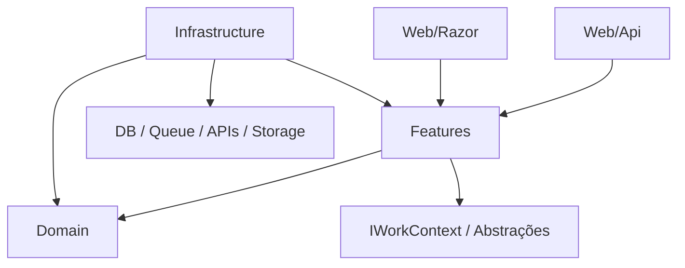

# Feature-Slice Architecture

**Nome conceitual:** Modular DDD + Hexagonal Pragmática + Feature Slices
**Versão:** 1.0
**Formato:** artigo/tutorial de referência
**Contexto:** arquitetura .NET/C# modular, pragmática, orientada a domínio, produtividade e agentes de IA, construída sobre o ecossistema `RoyalCode`.

---

## 1. Visão geral

Esta arquitetura combina quatro ideias principais:

1. **Modularidade por domínio.** O sistema é dividido em módulos de negócio. Cada módulo representa, idealmente, um **Bounded Context** do DDD ou uma capability de negócio suficientemente autônoma.

2. **DDD no núcleo interno.** Cada módulo possui um núcleo composto por **Domain** e **Features**. `Domain` concentra regras, entidades, value objects, eventos e serviços de domínio. `Features` concentra casos de uso, contratos operacionais de entrada/saída, validações, filtros e metadados pragmáticos da funcionalidade.

3. **Hexagonal Architecture como princípio, não como nomenclatura física.** Usamos os conceitos de interno/externo, entrada/saída e inversão de dependência, mas evitamos nomes físicos como `Ports`, `Driving`, `Driven` e `Adapters`. Esses termos servem para pensar a arquitetura, não para poluir a navegação do projeto.

4. **Feature Slices verticais.** O sistema é implementado por features/casos de uso. Uma feature mantém próximos os artefatos que mudam juntos: comando/consulta, modelo de entrada, modelo de saída, validação, filtros e, quando adequado, mapeamento HTTP.

Descrição curta:

> Arquitetura modular baseada em Bounded Contexts, com domínio explícito, features verticais, entradas web organizadas por tecnologia, infraestrutura pragmática e princípios hexagonais aplicados sem dogmatismo.

### 1.1 Influências

A arquitetura é uma síntese pragmática de várias linhas de pensamento, e não a reprodução fiel de nenhuma delas:

| Influência | Autor | O que entra nesta arquitetura |
|---|---|---|
| **Domain-Driven Design** | Eric Evans | Bounded Contexts, agregados, value objects, eventos, linguagem ubíqua |
| **Implementing DDD** | Vaughn Vernon | invariantes na raiz do agregado, coleta de eventos, modelagem tática |
| **Explicit Architecture** | Herberto Graça | fronteiras explícitas interno/externo; origem da **lente Explícita** ([referência](https://herbertograca.com/tag/explicit-architecture/)) |
| **Screaming Architecture / Clean Architecture** | Robert C. Martin | a estrutura "grita" o negócio, não o framework; origem da **lente Gritante** |
| **Vertical Slice & CQRS pragmático** | Jimmy Bogard | features como unidade operacional; comando/consulta próximos do contrato |

### 1.2 As duas lentes: Explícita e Gritante

O ponto central deste documento é que **a mesma arquitetura pode ser materializada sob duas lentes de organização de pastas**, e ambas são válidas. A escolha é estilística e de equipe, não conceitual.

- **Lente Explícita** (Herberto Graça) — organiza **primeiro por camada**. O módulo expõe na raiz `Domain/`, `Features/`, `Web/`, `Infrastructure/`. O domínio fica visível e separado, organizado internamente por agregados.

- **Lente Gritante** (Robert C. Martin) — organiza **primeiro por agregado/feature**. O módulo expõe na raiz apenas `Features/` (com cada agregado dentro, o seu `Domain/` aninhado e seus eventos de domínio ao lado), `Web/` e `Infrastructure/`. Ao abrir o projeto, o negócio "grita".

A diferença essencial entre as lentes é **onde o domínio vive**:

| | Lente Explícita | Lente Gritante |
|---|---|---|
| `Domain/` | na raiz do módulo, organizado por agregados | dentro de cada agregado em `Features/{Agregado}/Domain/` |
| `Events/` | dentro do agregado em `Domain/{Agregado}/Events/` | irmão de `Domain/` dentro do agregado em `Features/{Agregado}/Events/` |
| `Features/` | na raiz, organizado por agregados | na raiz, é a própria espinha dorsal do módulo |
| `Web/` | na raiz | na raiz |
| `Infrastructure/` | na raiz | na raiz |
| O que "grita" ao abrir o projeto | as camadas | os agregados de negócio |

Tudo o que segue neste documento é apresentado sob essas duas lentes. Camada de aplicação (Features), Web e Infrastructure são praticamente idênticas entre elas; o que muda é o posicionamento do `Domain/`.

---

## 2. O problema que a arquitetura resolve

Arquiteturas .NET costumam cair em dois extremos.

### 2.1 Excesso de camadas

```text
Controller
  -> Mediator
    -> CommandHandler
      -> Service
        -> Repository Interface
          -> Repository Implementation
            -> DbContext
              -> Entity
                -> Mapper
                  -> DTO
```

Justificável em sistemas muito complexos, mas para CRUD e casos de uso simples vira cerimônia: arquivos demais, indireção demais, pouca clareza.

### 2.2 Vertical Slice solta demais

```text
Features/
  CreateOrder/
    Endpoint.cs
    Handler.cs
    Request.cs
    Response.cs
```

Simples e produtivo, mas tende a gerar regras duplicadas, handlers gigantes, domínio anêmico, ausência de fronteiras entre módulos, acoplamento oculto e pouca governança sobre invariantes.

### 2.3 O meio-termo proposto

A proposta mantém, ao mesmo tempo:

- a produtividade das features verticais;
- a clareza dos módulos de negócio;
- a proteção do domínio do DDD;
- a separação conceitual da arquitetura hexagonal;
- a liberdade pragmática do .NET moderno (`RoyalCode.SmartCommands`, `WorkContext`, `SmartSearch`);
- a capacidade de gerar e manter código com agentes de IA.

---

## 3. Regra central

> **Módulo é a unidade de negócio. Feature é a unidade operacional. Domain é a unidade de regra. Infrastructure é a unidade técnica. Web é a unidade de entrada.**

Em forma estrutural, sob a **lente Explícita**:

```text
Module/
  Domain/
  Features/
  Web/
  Infrastructure/
```

E, sob a **lente Gritante**:

```text
Module/
  Features/
    {Agregado}/
      Domain/
      Events/
      {Feature}/
  Web/
  Infrastructure/
```

---

## 4. Estrutura de solução

Uma solução completa pode ser organizada assim:

```text
Company.Solution/
  src/
    Apps/
      Company.Solution.Api/
      Company.Solution.Web/

    Modules/
      Company.Solution.Products/
      Company.Solution.Sales/
      Company.Solution.Billing/
      Company.Solution.Identity/

    Common/
      Company.Solution.Common/
      Company.Solution.EfMigrations/

  tests/
    Company.Solution.UnitTests/
    Company.Solution.IntegrationTests/
    Company.Solution.ArchitectureTests/

  docs/
    architecture.md
```

### 4.1 `Apps`

Aplicações executáveis: API ASP.NET Core, Blazor Server, Worker, CLI, host modular. Consomem os módulos de negócio e fazem a composição (DI, pipeline HTTP, migrações).

```text
Apps/
  Company.Solution.Api/
  Company.Solution.Web/
  Company.Solution.Worker/
```

### 4.2 `Modules`

Os módulos de negócio. Cada módulo é suficientemente autônomo e representa uma fronteira conceitual clara (Bounded Context ou capability).

```text
Modules/
  Company.Solution.Products/
  Company.Solution.Sales/
  Company.Solution.Billing/
```

### 4.3 `Common`

Código compartilhado que não pertence a um módulo específico (Shared Kernel + utilitários + migrações EF). Deve ser pequeno e estável — ver seção 17.

```text
Common/
  Company.Solution.Common/
  Company.Solution.EfMigrations/
```

### 4.4 `tests`

Testes unitários (domínio), de integração (features completas) e de arquitetura (fronteiras).

```text
tests/
  Company.Solution.UnitTests/
  Company.Solution.IntegrationTests/
  Company.Solution.ArchitectureTests/
```

---

## 5. Estrutura interna de um módulo

A forma resumida foi apresentada na seção 3. Esta seção apresenta a **estrutura expandida** sob as duas lentes.

> **Regra de quebra (importante).** As subpastas internas devem ser orientadas **a camadas** (estilo Explícito) **ou a agregados** (estilo Gritante). **Nunca** quebre o domínio em tipos de objeto (`Entities/`, `ValueObjects/`, `Services/`, `Policies/`) — isso espalha um mesmo conceito de negócio por várias pastas e contraria tanto o DDD quanto a leitura "gritante" do negócio.

### 5.1 Estrutura expandida — lente Explícita

```text
{Company}.{Solution}.{Module}/
  Domain/
    {Agregados}/
    Support/
    Commons/

  Features/
    {Agregados}/
      Commons/
      {Feature}/
    {Feature}/

  Web/
    Api/
    Razor/

  Infrastructure/
    Data/
    Searches/
    Messaging/
    Gateways/
    Security/
```

- Em `Domain/`, cada agregado tem sua pasta nomeada **no plural** (`Products`, `Orders`). `Support` ou `Commons` guardam tipos úteis a múltiplos agregados ou entidades simples de apoio.
- Em `Features/`, os agregados **reaparecem no plural**. As features de cada agregado são separadas em duas categorias (ver seção 7).
- `Gateways` é o nome preferido para acesso a serviços externos (classes que funcionam como gateways); `ExternalServices` também é aceito.

### 5.2 Estrutura expandida — lente Gritante

```text
{Company}.{Solution}.{Module}/
  Features/
    {Agregado}/
      Domain/
      Events/
      Commons/
      {Feature}/
    {Feature}/

  Web/
    Api/
    Razor/

  Infrastructure/
    Data/
    Searches/
    Messaging/
    Gateways/
    Security/
```

Aqui não há `Domain/` na raiz: ele vive dentro de cada agregado em `Features/{Agregado}/Domain/`. `Web/` e `Infrastructure/` permanecem na raiz, idênticos à lente Explícita.

---

## 6. `Domain`

`Domain` contém o modelo de domínio do módulo: entidades, agregados, value objects, eventos de domínio, serviços de domínio, policies e invariantes.

### 6.1 O que pertence — e o que não pertence — ao domínio

Pertence ao domínio:

- regra que continua valendo mesmo se a API mudar;
- invariantes de entidade/agregado;
- transições de estado e cálculo de valores de negócio;
- eventos de domínio;
- policies que expressam linguagem do domínio.

**Não** pertence ao domínio: endpoint HTTP, atributo de rota, mapeamento EF Core, envio de e-mail, chamada a API externa, query de tela, paginação, DTO de API, serialização JSON, autenticação de framework — em suma, qualquer código de infraestrutura ou de entrada.

### 6.2 Estrutura de `Domain` (corrigida)

Na lente Explícita, `Events/` fica dentro do agregado em `Domain/{Agregado}/Events/`. Na lente Gritante, `Events/` fica ao lado de `Domain/`, como irmão dentro de `Features/{Agregado}/`; mesmo assim, continua sendo artefato de domínio.

O domínio de um agregado é **plano dentro da pasta do agregado**. Não se quebra em `Entities/`, `ValueObjects/`, etc.

**Lente Explícita** — o domínio fica na raiz do módulo, por agregado:

```text
MyCompany.MySolution.Products/
  Domain/
    Products/
      Product.cs
      ProductCode.cs
      ProductName.cs
      ProductPrice.cs
      ProductStatus.cs
      ProductPricingService.cs
      ProductActivationPolicy.cs
      Events/
        ProductCreated.cs
        ProductPriceChanged.cs
```

**Lente Gritante** — o domínio fica dentro do agregado, em `Features/`:

```text
MyCompany.MySolution.Products/
  Features/
    Products/
      Domain/
        Product.cs
        ProductCode.cs
        ProductName.cs
        ProductPrice.cs
        ProductStatus.cs
        ProductPricingService.cs
        ProductActivationPolicy.cs
      Events/
        ProductCreated.cs
        ProductPriceChanged.cs
```

### 6.3 Domínio com as bibliotecas RoyalCode

Entidades herdam `Entity<TId>` / `Entity<TId, TCode>`; raízes de agregado herdam `AggregateRoot<TId>` / `AggregateRoot<TId, TCode>` e coletam eventos com `AddEvent`. Eventos herdam `DomainEventBase`. Métodos de negócio retornam `Result`/`Result<T>` (SmartProblems) — **nunca lançam exceção para fluxo esperado**.

Convenções obrigatórias (ver `.ai/references/external-libraries/domain.md`):

- construtor protegido sem parâmetros para desserialização, envolto em `#nullable disable/restore`;
- entidades **não seladas** (permitem herança);
- setters de `Id`/`Code` protegidos — estado muda por construtores/métodos de domínio;
- ordem dos membros: campos privados, construtores, propriedades, métodos;
- documentação XML em tipos e membros públicos.

Raiz de agregado:

```csharp
using RoyalCode.Aggregates;
using RoyalCode.SmartProblems;

/// <summary>Produto do catálogo. Raiz do agregado de produtos.</summary>
public class Product : AggregateRoot<Guid>
{
#nullable disable
    protected Product() { }
#nullable restore

    private Product(ProductCode code, ProductName name, ProductPrice price)
    {
        Id = Guid.NewGuid();
        Code = code;
        Name = name;
        Price = price;
        Status = ProductStatus.Active;
        AddEvent(new ProductCreated(Id, Code));
    }

    public ProductCode Code { get; private set; }
    public ProductName Name { get; private set; }
    public ProductPrice Price { get; private set; }
    public ProductStatus Status { get; private set; }

    /// <summary>Cria um produto ativo a partir de value objects já validados.</summary>
    public static Product Create(ProductCode code, ProductName name, ProductPrice price)
        => new(code, name, price);

    /// <summary>Altera o preço. Produtos inativos não podem ter o preço alterado.</summary>
    public Result ChangePrice(ProductPrice newPrice)
    {
        if (Status == ProductStatus.Inactive)
            return Problems.InvalidState("Inactive products cannot have their price changed.");

        Price = newPrice;
        AddEvent(new ProductPriceChanged(Id, newPrice.Value));
        return Result.Ok();
    }
}
```

Value object validável (`IValidable` + `RuleSet`):

```csharp
using RoyalCode.SmartProblems;
using RoyalCode.SmartValidations;

/// <summary>Preço de um produto. Nunca negativo.</summary>
public readonly record struct ProductPrice(decimal Value) : IValidable
{
    public bool HasProblems(out Problems? problems)
        => Rules.Set<ProductPrice>()
            .GreaterThanOrEqual(Value, 0)
            .HasProblems(out problems);
}
```

Evento de domínio:

```csharp
using RoyalCode.DomainEvents;

/// <summary>Disparado quando o preço de um produto muda.</summary>
public sealed class ProductPriceChanged(Guid productId, decimal newPrice) : DomainEventBase
{
    public Guid ProductId { get; } = productId;
    public decimal NewPrice { get; } = newPrice;
}
```

> O agregado **apenas coleta** eventos em `DomainEvents`; a publicação/dispatch é responsabilidade da infraestrutura (WorkContext/UnitOfWork/Outbox) após `SaveChanges`.

---

## 7. `Features`

`Features` é a camada de aplicação e **substitui** a separação rígida entre `Application` e `Contracts`. Uma feature contém os artefatos operacionais do caso de uso: comando ou consulta, contrato de entrada, modelo de saída, validação, filtros e, quando adequado, metadados HTTP.

A estrutura de `Features` é **idêntica nas duas lentes** — o que muda é apenas onde o `Domain/` está posicionado (raiz, na Explícita; dentro do agregado, na Gritante).

### 7.1 Duas categorias de feature por agregado

Dentro da pasta de cada agregado, as features se dividem em:

1. **`Commons/`** — features **CRUD-like** (`CreateProduct`, `UpdateProduct`, `GetProductDetails`, `SearchProducts`) **mais** os objetos de contrato comuns (`ProductDetails`, `ProductSummary`, `ProductFilters`). São operações previsíveis sobre o agregado que não carregam intenção de negócio distinta.

2. **`{Feature}/`** — uma pasta dedicada para cada feature que **representa intenção de negócio** e **não** é CRUD-like (ex.: `ChangePrice/`, `Activate/`, `Discontinue/`).

Features que representam intenção de negócio mas **não pertencem a um único agregado** ganham sua própria pasta diretamente em `Features/` (fora de qualquer agregado).

### 7.2 Padrão de organização

```text
{Company}.{Solution}.{Module}/
  Features/
    Products/
      Commons/
        CreateProduct.cs
        GetProductDetails.cs
        UpdateProduct.cs
        ProductDetails.cs
        ProductFilters.cs
        ProductSummary.cs
        SearchProducts.cs
      ChangePrice/
        ChangeProductPrice.cs
        ChangeProductPriceHandler.cs
        IChangeProductPriceHandler.cs
    {Feature}/
```

> `ChangeProductPriceHandler.cs` e `IChangeProductPriceHandler.cs` aparecem aqui por clareza conceitual: eles são o handler do caso de uso. Com `RoyalCode.SmartCommands` **esses dois arquivos são gerados** pelo Source Generator a partir do comando `ChangeProductPrice.cs` — na prática você costuma autorar apenas o comando. Mantenha-os mentalmente como parte da feature.

### 7.3 Nomes semânticos (não sufixos técnicos)

Prefira nomes que expressem o papel real do tipo. **Evite** sufixos reflexivos como `Request`, `Response`, `Command`, `Query`, `Event` quando houver um nome de domínio melhor.

| Use | Em vez de |
|---|---|
| `CreateProduct` | `CreateProductCommand` / `CreateProductRequest` |
| `ChangeProductPrice` | `ChangeProductPriceCommand` |
| `GetProductDetails` | `GetProductDetailsQuery` |
| `ProductDetails` | `ProductDetailsResponse` / `ProductDto` |
| `ProductSummary` | `ProductListItemDto` |

---

## 8. Comandos com SmartCommands (escrita)

Features de escrita usam `RoyalCode.SmartCommands`. Uma classe **parcial** declara o modelo de entrada e um método `[Command]`; o Source Generator gera `I{Comando}Handler` e `{Comando}Handler` com validação, Unit of Work, carregamento de entidades, decorators e mapeamento HTTP. Detalhes em `.ai/references/external-libraries/commands.md`.

### 8.1 Criação (produz nova entidade)

```csharp
using RoyalCode.SmartCommands;
using RoyalCode.SmartProblems;
using RoyalCode.SmartValidations;
using RoyalCode.WorkContext.Abstractions;

[MapPost("/api/products", "CreateProduct")]
[MapGroup("Products")]
[WithSummary("Create a product")]
[MapCreatedRoute("/api/products/{id}")]
[MapIdResultValue]
public partial class CreateProduct
{
    public string Code { get; init; } = string.Empty;
    public string Name { get; init; } = string.Empty;
    public decimal Price { get; init; }

    public bool HasProblems(out Problems? problems)
        => Rules.Set<CreateProduct>()
            .NotEmpty(Code)
            .NotEmpty(Name)
            .GreaterThanOrEqual(Price, 0)
            .HasProblems(out problems);

    [Command, WithValidateModel, WithWorkContext]
    public Result<Product> Execute(IWorkContext workContext)
    {
        var product = Product.Create(new ProductCode(Code), new ProductName(Name), new ProductPrice(Price));
        workContext.Add(product);
        return product;
    }
}
```

O handler gerado valida `HasProblems`, inicia o Unit of Work, persiste a entidade adicionada, completa o UoW e, com `MapCreatedRoute` + `MapIdResultValue`, responde `201 Created` com `Location` construída a partir do `Id` do resultado.

### 8.2 Edição de entidade existente (`EditEntity`)

Neste exemplo, o `id` vem da rota (`/api/products/{id}/price`) e é encaminhado ao handler gerado; por isso o comando contém apenas o payload da alteração. O primeiro parâmetro do método é a entidade carregada. O handler trata `NotFound` automaticamente.

```csharp
[MapPatch("/api/products/{id}/price", "ChangeProductPrice")]
[MapGroup("Products")]
public partial class ChangeProductPrice
{
    public decimal Price { get; init; }

    public bool HasProblems(out Problems? problems)
        => Rules.Set<ChangeProductPrice>()
            .GreaterThanOrEqual(Price, 0)
            .HasProblems(out problems);

    [Command, WithValidateModel, WithWorkContext, EditEntity(typeof(Product))]
    public Result Execute(Product product)
    {
        WasValidated();
        return product.ChangePrice(new ProductPrice(Price));
    }
}
```

> `WithWorkContext`, `WithUnitOfWork<TContext>` e `WithDbContext` são alternativas mutuamente exclusivas para prover Unit of Work. Esta arquitetura prefere `WithWorkContext`, coerente com o uso de `IWorkContext` como abstração padrão (seção 12).

---

## 9. Consultas e buscas com SmartSearch + SmartSelector (leitura)

Não existe um atributo `[Query]` em SmartCommands. Leituras usam `RoyalCode.SmartSearch` (`ICriteria<TEntity>`, filtros declarativos, ordenação, paginação) e `RoyalCode.SmartSelector` para projeção em DTO. Ver `search.md` e `selector.md`.

### 9.1 Filtro declarativo e DTO de saída

O filtro e os DTOs ficam em `Features/Products/Commons/`:

```csharp
using System.ComponentModel;
using RoyalCode.SmartSearch;

/// <summary>Filtros de busca de produtos.</summary>
public sealed class ProductFilters
{
    [Criterion]
    public string? Name { get; init; }

    [Criterion(TargetPropertyPath = "Code.Value")]
    public string? Code { get; init; }
}

/// <summary>Visão resumida de produto para listagens.</summary>
public sealed record ProductSummary
{
    public Guid Id { get; init; }
    public string Code { get; init; } = string.Empty;
    public string Name { get; init; } = string.Empty;
    public decimal Price { get; init; }
}

/// <summary>Visão detalhada de produto.</summary>
public sealed record ProductDetails
{
    public Guid Id { get; init; }
    public string Code { get; init; } = string.Empty;
    public string Name { get; init; } = string.Empty;
    public decimal Price { get; init; }
    public string Status { get; init; } = string.Empty;
}
```

### 9.2 Orquestração da busca

`IWorkContext.Criteria<TEntity>()` aplica `FilterBy`, `OrderBy`, `Select<TDto>()` e materializa com `AsSearch().ToListAsync()` (retorna `ResultList<T>` paginado) ou `Collect()` (lista simples, mantém tracking do EF):

```csharp
var page = await workContext.Criteria<Product>()
    .FilterBy(filters)
    .OrderBy(new Sorting { OrderBy = "Name" })
    .Select<ProductSummary>()
    .AsSearch()
    .ToListAsync(ct);
// page: ResultList<ProductSummary> com Page, ItemsPerPage, Count, Pages, Items
```

A projeção `Select<ProductSummary>()` pode mapear por convenção de nome ou por seletor registrado. Quando o DTO precisa desempacotar value objects (`Code.Value`), registre o seletor na infraestrutura de buscas (seção 11.2). Quando o DTO mapeia 1×1 membros simples da entidade, prefira `SmartSelector`:

```csharp
[AutoSelect<Product>, AutoProperties]
public partial class ProductSnapshot { } // gera Select/From/expressão traduzível pelo EF
```

### 9.3 Detalhe único com `FindResult`

Para um item por ID, `TryFindAsync`/`TryFindByAsync` (EF) retornam `FindResult<T>`, convertível em `Result` com `NotFound` padronizado:

```csharp
var found = await workContext.Repository<Product>().TryFindAsync(id);
return found.NotFound(out var problem)
    ? problem
    : ProductDetails.From(found.Entity);
```

---

## 10. `Web`

`Web` contém os mecanismos de **entrada** relacionados à web.

```text
Web/
  Api/
  Razor/
```

### 10.1 `Web/Api`

Grupos de rotas, mapeamentos manuais, configuração de API e extensões `Map…`. Use mapeamento manual quando atributos na feature não bastam (ver seção 13.1). Endpoints devem priorizar `OkMatch`, `CreatedMatch`, `NoContentMatch` (`RoyalCode.SmartProblems.AspNetCore`) para conversão automática de `Result`/`Problems` em `ProblemDetails`.

```csharp
public static class ProductsApi
{
    public static IEndpointRouteBuilder MapProductsApi(this IEndpointRouteBuilder app)
    {
        var group = app.MapGroup("/api/products").WithTags("Products");

        // Busca paginada: leitura via SmartSearch
        group.MapGet("/", async (
            [AsParameters] ProductFilters filters,
            IWorkContext workContext,
            CancellationToken ct) =>
        {
            var page = await workContext.Criteria<Product>()
                .FilterBy(filters)
                .Select<ProductSummary>()
                .AsSearch()
                .ToListAsync(ct);

            return Results.Ok(page);
        });

        return app;
    }
}
```

> Os endpoints de **escrita** (`CreateProduct`, `ChangeProductPrice`) já são mapeados pelos atributos `Map*` nas próprias features via SmartCommands — não precisam de mapeamento manual aqui.

### 10.2 `Web/Razor`

Componentes Razor/Blazor e modelos específicos de UI, quando o módulo possui interface. Em sistemas backend-only, `Web/Razor` simplesmente não existe. Para Blazor WebAssembly público/grande, avalie separar os componentes e/ou contratos em projeto próprio.

---

## 11. `Infrastructure`

Implementações técnicas usadas pelo módulo. Organização por responsabilidade técnica:

```text
Infrastructure/
  Data/
  Searches/
  Messaging/
  Gateways/
  Security/
```

Pertence à infraestrutura: mapeamentos EF Core, `DbContext`, mensageria, integração externa, cache, storage, e-mail, clients HTTP, indexação, publicação de eventos, outbox/inbox. **Não** pertence: regra de domínio, invariante de entidade, decisão de caso de uso, contrato principal da feature.

### 11.1 `Data` — mapeamentos e configuração do WorkContext

```csharp
using Microsoft.EntityFrameworkCore;

public sealed class ProductMapping : IEntityTypeConfiguration<Product>
{
    public void Configure(EntityTypeBuilder<Product> builder)
    {
        builder.ToTable("Products");
        builder.HasKey(p => p.Id);
        builder.OwnsOne(p => p.Code);
        builder.OwnsOne(p => p.Name);
        builder.OwnsOne(p => p.Price);
    }
}
```

Cada módulo expõe um método de extensão que configura o `IWorkContextBuilder` (model, repositórios, buscas, commands, queries) por assembly:

```csharp
public static class ProductsModule
{
    public static IWorkContextBuilder<TDbContext> ConfigureProducts<TDbContext>(
        this IWorkContextBuilder<TDbContext> builder)
        where TDbContext : DbContext
        => builder
            .ConfigureModel(m => m.ApplyConfigurationsFromAssembly(typeof(ProductsModule).Assembly))
            .AddRepositories(typeof(ProductsModule).Assembly)
            .ConfigureSearches(typeof(ProductsModule).Assembly)
            .ConfigureCommands(typeof(ProductsModule).Assembly)
            .ConfigureQueries(typeof(ProductsModule).Assembly);
}
```

### 11.2 `Searches` — seletores e ordenações nomeadas

Quando a projeção precisa desempacotar value objects ou usar ordenações por caminho, registre-as aqui:

```csharp
cfg.Add<Product>();
cfg.AddOrderBy<Product, string>("Name", p => p.Name.Value);
cfg.AddSelector<Product, ProductSummary>(p => new ProductSummary
{
    Id = p.Id,
    Code = p.Code.Value,
    Name = p.Name.Value,
    Price = p.Price.Value,
});
```

### 11.3 `Gateways` — serviços externos

Acesso a serviços externos (preferir o termo `Gateways`; `ExternalServices` também é aceito). Cada grupo de API externa tem interface + implementação, usa `HttpClientFactory`, retorna `Result`/`Result<T>` via `ToResultAsync()`, e aplica retry/circuit breaker com Polly.

```csharp
public interface IPaymentGateway
{
    Task<Result<PaymentReceipt>> ChargeAsync(PaymentOrder order, CancellationToken ct);
}
```

---

## 12. `WorkContext` como abstração pragmática

`IWorkContext` é a **abstração padrão** de acesso a dados do módulo. Ele unifica Unit of Work, Repositories, SmartSearch (`Criteria`), Commands (`SendAsync`) e Queries (`QueryAsync`). Esta arquitetura não busca pureza hexagonal absoluta: aceita abstrações de plataforma quando reduzem boilerplate e aumentam consistência.

| Use `IWorkContext` diretamente quando… | Crie uma interface específica quando… |
|---|---|
| a operação é comum (CRUD, busca) | há integração externa (gateway) |
| o padrão da solução já é RoyalCode | há múltiplas implementações |
| a abstração reduz código | a dependência expressa linguagem de domínio |
| não há necessidade de esconder a persistência | é preciso isolar regra para testes/variações |

> `WorkContext` facilita a persistência, mas **não substitui** as regras de domínio. Invariantes continuam na raiz do agregado.

---

## 13. HTTP: atributos na feature × `Web/Api` manual

A arquitetura permite metadados HTTP na própria feature (via SmartCommands) quando isso aumenta produtividade sem comprometer clareza.

### 13.1 Critério de decisão

| Caso | Escolha |
|---|---|
| CRUD simples, rota direta, contrato = comando | atributos `Map*` na feature |
| autorização simples, sem versionamento | atributos na feature |
| API pública versionada | `Web/Api` manual |
| upload/download/streaming | `Web/Api` manual |
| múltiplas rotas para o mesmo caso de uso | `Web/Api` manual |
| endpoint compõe várias features | `Web/Api` manual |
| contrato HTTP difere do comando | `Web/Api` manual |

---

## 14. Result, Problems e validação

Linguagem uniforme para resultados e erros, com `RoyalCode.SmartProblems` e `RoyalCode.SmartValidations`. **Exceções ficam reservadas a falhas excepcionais/bugs**; falhas esperadas retornam problemas estruturados.

Categorias de `Problems` e status HTTP:

| Categoria | Status | Quando |
|---|---|---|
| `InvalidParameter` | 400 | entrada inválida do cliente |
| `ValidationFailed` | 422 | regra de negócio violada (entrada sintaticamente válida) |
| `NotAllowed` | 403 | autorização/política |
| `InvalidState` | 409 | conflito/transição inválida |
| `NotFound` | 404 | recurso inexistente |
| `InternalServerError` | 500 | erro inesperado |
| `CustomProblem` | definido | erro de domínio específico (com `typeId`) |

Validação de entrada com `RuleSet` em `HasProblems`; composição de fluxo com `Result.Map`/`Continue`/`Match`; conversão para API com `OkMatch`/`CreatedMatch`/`NoContentMatch`.

---

## 15. Fronteiras hexagonais sem nomenclatura hexagonal

Usamos os conceitos hexagonais para pensar fronteiras, mas nomeamos as pastas de forma concreta.

| Conceito hexagonal | Nome físico recomendado |
|---|---|
| Driving Adapter | `Web/Api`, `Web/Razor`, `Consumers`, `Jobs`, `Cli` |
| Driven Adapter | `Infrastructure/Data`, `Infrastructure/Messaging`, `Infrastructure/Gateways` |
| Port | `IWorkContext` e abstrações de plataforma; gateways/providers específicos |
| Application Core | `Domain` + `Features` |
| Adapter | nome técnico concreto: `EfCore`, `RabbitMq`, `SendGrid`, `S3`, `Redis` |

**Não** use como nomes de pasta principais: `Ports/`, `Driving/`, `Driven/`, `Adapters/`. O desenvolvedor quer achar endpoints, queries, persistência e integrações — não traduzir termos acadêmicos a cada navegação.

---

## 16. Dependências permitidas

```text
Domain
  não depende de Features, Web ou Infrastructure

Features
  pode depender de Domain e de abstrações de plataforma aprovadas (IWorkContext)
  não deve depender de Web nem de implementação concreta de Infrastructure

Web
  pode depender de Features (e dos modelos da feature)
  não deve conter regra de domínio

Infrastructure
  pode depender de Domain e de Features (ao implementar o que a feature pede)
  não deve conter regra de domínio
```



> O domínio é o ponto mais estável. Features orquestram o domínio. Web aciona features. Infrastructure implementa detalhes técnicos. Em um único projeto por módulo, essas fronteiras dependem de **disciplina e testes de arquitetura** (seção 20).

---

## 17. Comunicação entre módulos e Shared Kernel

Módulos **não** acessam livremente o domínio interno de outros módulos. Formas aceitáveis: eventos de integração, APIs internas, contratos públicos estáveis, Shared Kernel mínimo, serviços de aplicação explicitamente expostos, read models locais.

Evite: `Sales` mexendo no `DbContext` de `Billing`; um módulo usando entidades internas de outro; um `SharedKernel` gigante.

`Common`/`SharedKernel` deve ser pequeno e estável: `Result`, `Problem`, `Entity`, `ValueObject`, `DomainEvent`, abstrações realmente universais. Se algo muda por causa de um módulo específico, provavelmente **não** pertence ao Shared Kernel.

---

## 18. Um projeto por módulo

A base usa **um projeto C# por módulo** (modular monolith): menos projetos, build e navegação mais simples, melhor ergonomia para agentes de IA.

Desvantagem: o C# não impede `Domain` de referenciar `Infrastructure` — as fronteiras dependem de disciplina e de testes de arquitetura.

Divida em mais projetos apenas como **exceção motivada**: Blazor WASM com payload controlado, contratos compartilhados com cliente externo, infraestrutura com dependências pesadas, enforcing por compilação, ou módulo a ser extraído como serviço.

---

## 19. Exemplo completo: módulo `Products`

A seguir, o mesmo módulo sob as duas lentes.

### 19.1 Lente Explícita

```text
MyCompany.MySolution.Products/
  Domain/
    Products/
      Product.cs
      ProductCode.cs
      ProductName.cs
      ProductPrice.cs
      ProductStatus.cs
      ProductPricingService.cs
      ProductActivationPolicy.cs
      Events/
        ProductCreated.cs
        ProductPriceChanged.cs

  Features/
    Products/
      Commons/
        CreateProduct.cs
        UpdateProduct.cs
        GetProductDetails.cs
        SearchProducts.cs
        ProductDetails.cs
        ProductSummary.cs
        ProductFilters.cs
      ChangePrice/
        ChangeProductPrice.cs

  Web/
    Api/
      ProductsApi.cs

  Infrastructure/
    Data/
      ProductMapping.cs
      ProductsModule.cs
    Searches/
      ProductsSearchConfig.cs
    Messaging/
      ProductCreatedPublisher.cs
```

### 19.2 Lente Gritante

```text
MyCompany.MySolution.Products/
  Features/
    Products/
      Domain/
        Product.cs
        ProductCode.cs
        ProductName.cs
        ProductPrice.cs
        ProductStatus.cs
        ProductPricingService.cs
        ProductActivationPolicy.cs
      Events/
        ProductCreated.cs
        ProductPriceChanged.cs
      Commons/
        CreateProduct.cs
        UpdateProduct.cs
        GetProductDetails.cs
        SearchProducts.cs
        ProductDetails.cs
        ProductSummary.cs
        ProductFilters.cs
      ChangePrice/
        ChangeProductPrice.cs

  Web/
    Api/
      ProductsApi.cs

  Infrastructure/
    Data/
      ProductMapping.cs
      ProductsModule.cs
    Searches/
      ProductsSearchConfig.cs
    Messaging/
      ProductCreatedPublisher.cs
```

O conteúdo dos arquivos (domínio, comandos, busca, infraestrutura) é exatamente o mostrado nas seções 6, 8, 9 e 11 — **apenas o posicionamento de `Domain/` muda entre as lentes**.

---

## 20. Testes

- **Unit tests** — domínio puro: entidades, value objects, serviços de domínio, policies. Foco em invariantes e transições de estado.
- **Integration tests** — features completas: endpoints, persistência (WorkContext), validação, SmartCommands, SmartSearch.
- **Architecture tests** — fronteiras: `Domain` não depende de `Infrastructure`; `Features` não depende de `Web`; `Infrastructure` não contém endpoints; módulos não acessam o domínio interno uns dos outros; `Common`/SharedKernel não depende de módulos.

```text
tests/
  UnitTests/Products/ProductTests.cs
  IntegrationTests/Products/CreateProductTests.cs
  ArchitectureTests/ModuleDependencyTests.cs
```

---

## 21. Comparações

### 21.1 Clean Architecture clássica

Organiza primeiro por **camada global** (`Api/`, `Application/`, `Domain/`, `Infrastructure/`, `Contracts/`). Esta arquitetura organiza primeiro por **módulo de negócio** e absorve `Application` + `Contracts` em `Features`.

### 21.2 Vertical Slice Architecture pura

VSA pura tem features, mas domínio opcional/anêmico e sem fronteira modular. Aqui as features verticais **preservam** domínio explícito e fronteira de Bounded Context.

### 21.3 Explicit Architecture (Herberto Graça)

Captamos o núcleo (DDD, hexagonal conceitual, componentes/bounded contexts), mas trocamos a nomenclatura acadêmica (`Ports`/`Adapters`) por estrutura idiomática e produtiva em .NET. É a origem da **lente Explícita**.

### 21.4 Estrutura anterior `Application` + `Contracts`

```text
Application + Contracts  ->  Features
```

Menos ambiguidade e duplicação, melhor alinhamento com SmartCommands, contratos operacionais perto do caso de uso. Contratos públicos/versionados, quando existirem, saem de `Features` para um projeto/pasta de contratos — exceção motivada.

---

## 22. Anti-patterns

| Anti-pattern | Correção |
|---|---|
| **Domínio anêmico** (regra no handler) | mover invariantes/transições para entidades, value objects e policies |
| **Feature gigante** (`ManageProducts` com tudo) | dividir por caso de uso real (`CreateProduct`, `ChangeProductPrice`, …) |
| **Quebrar domínio por tipo de objeto** (`Entities/`, `ValueObjects/`, `Services/`) | organizar por **agregado** (Gritante) ou por **camada** com agregados dentro (Explícita) |
| **Regra de negócio na Infrastructure** | mover para `Domain`/`Features` |
| **SharedKernel inchado** | manter pequeno e estável |
| **Sufixos genéricos** (`ProductDto2`, `ProductRequest`) | nomes semânticos (`ProductDetails`, `ProductSummary`) |
| **Dogmatismo hexagonal** (`Ports/`, `Driving/`, `Driven/`) | usar os conceitos, nomear pastas de forma concreta |
| **`WorkContext` como desculpa para ignorar o domínio** | persistência é facilitada, regra continua no domínio |
| **Inventar `[Query]`** | leitura usa SmartSearch (`ICriteria`) / `QueryAsync`, não um atributo inexistente |

---

## 23. Critérios de decisão

**Atributos HTTP ou `Web/Api` manual?** — ver tabela 13.1.

**Consulta em Feature ou Infrastructure?**

| Caso | Escolha |
|---|---|
| consulta representa caso de uso | Feature (filtro + DTO) |
| projeção técnica pesada / seletor com VO | `Infrastructure/Searches` |
| SQL provider-specific | `Infrastructure/Data` |
| regra de negócio | `Domain`/`Feature`, nunca Infrastructure |

**`IWorkContext` ou interface específica?** — ver tabela da seção 12.

**Explícita ou Gritante?**

| Prefira Explícita quando… | Prefira Gritante quando… |
|---|---|
| equipe valoriza ver as camadas na raiz | equipe quer que o negócio "grite" ao abrir o projeto |
| domínio grande e compartilhado entre features do agregado | domínio fortemente coeso a cada agregado |
| migração a partir de Clean Architecture | greenfield orientado a feature slices |

> A escolha da lente é **por módulo e por equipe**, e deve ser consistente dentro de um mesmo módulo.

---

## 24. Checklists

### 24.1 Criação de um módulo

- [ ] Representa um Bounded Context / capability clara, com nome de **negócio**?
- [ ] Escolheu a lente (Explícita ou Gritante) e a aplicou de forma consistente?
- [ ] `Domain` contém regras e conceitos (sem quebra por tipo de objeto)?
- [ ] Agregados nomeados no **plural** em `Domain/` e `Features/`?
- [ ] `Features` separa `Commons/` (CRUD-like + contratos) de pastas de **intenção de negócio**?
- [ ] `Web/Api` contém só entrada HTTP; `Web/Razor` só existe se há UI?
- [ ] `Infrastructure` contém só detalhes técnicos (`Data`, `Searches`, `Messaging`, `Gateways`, `Security`)?
- [ ] Sem `Ports`/`Driving`/`Driven` como pastas?
- [ ] Há testes de arquitetura para as fronteiras importantes?

### 24.2 Criação de uma feature

- [ ] O nome expressa uma **intenção real** (sem sufixos técnicos reflexivos)?
- [ ] A feature é pequena e coesa?
- [ ] Comando (`[Command]`) ou filtro/DTO de busca estão na pasta da feature?
- [ ] Validações retornam `Problems`/`Result` (via `RuleSet`)?
- [ ] Regras de domínio foram colocadas no **domínio**?
- [ ] Escrita usa SmartCommands; leitura usa SmartSearch/`ICriteria`?
- [ ] Metadados HTTP na feature só quando suficientes; senão, `Web/Api`?
- [ ] Um agente de IA entenderia a feature olhando só a pasta dela?

---

## 25. Orientações para agentes de IA

Esta arquitetura é amigável a agentes porque cada feature é local, os nomes são semânticos, o domínio é explícito e há menos camadas cerimoniais.

Regras para um agente:

```text
1.  Identifique o módulo correto antes de criar código.
2.  Identifique a lente do módulo (Explícita ou Gritante) e respeite-a.
3.  Regra de negócio -> Domain (entidade/VO/policy), retornando Result/Problems.
4.  Caso de uso de escrita -> Feature com [Command] (SmartCommands).
5.  Caso de uso de leitura -> Feature com filtro + DTO + SmartSearch (ICriteria); NUNCA invente [Query].
6.  CRUD-like -> Features/{Agregado}/Commons/. Intenção de negócio -> pasta própria.
7.  Endpoint simples -> atributos Map* na feature; senão -> Web/Api.
8.  Persistência -> IWorkContext / Infrastructure/Data.
9.  Não quebre o domínio em Entities/ValueObjects/Services/Policies.
10. Não crie Ports/Driving/Driven; não crie IRepository<T> genérico se IWorkContext resolve.
11. Não crie Request/Response/Command/Query por reflexo; use nomes semânticos.
12. Validação com RuleSet; fluxo esperado com Result/Problems, não exceções.
```

---

## 26. Migração da estrutura anterior

De `Application` + `Contracts`:

1. Renomeie `Application/UseCases` para `Features` e mova comandos/consultas para pastas de feature.
2. Mova contratos **operacionais** para a feature correspondente; separe apenas contratos públicos/versionados.
3. Agrupe features CRUD-like e contratos comuns em `Commons/`; dê pasta própria a cada feature de intenção de negócio.
4. Reorganize o domínio por **agregado** (sem quebra por tipo de objeto); escolha a lente.
5. Revise nomes `Request`/`Response`/`Command`/`Query` para nomes semânticos.
6. Troque exceções de fluxo por `Result`/`Problems`; valide com `RuleSet`.
7. Mantenha implementação técnica pesada em `Infrastructure`.
8. Adote SmartCommands (escrita) e SmartSearch/SmartSelector (leitura).
9. Adicione testes de arquitetura para as novas fronteiras.

---

## 27. Conclusão

A arquitetura é um equilíbrio entre rigor e pragmatismo. Ela combina:

- módulos como Bounded Contexts;
- domínio explícito (RoyalCode.Entities/Aggregates/DomainEvents);
- features como unidade operacional, com contratos operacionais dentro delas;
- HTTP por atributos (SmartCommands) quando conveniente, com fallback para `Web/Api`;
- infraestrutura separada por responsabilidade técnica;
- `IWorkContext` como abstração pragmática; SmartSearch/SmartSelector no lugar de Specification clássico;
- nomenclatura concreta em vez de termos hexagonais abstratos;
- **duas lentes** — Explícita e Gritante — para a mesma arquitetura.

Síntese final:

> **Domain protege o negócio. Features implementam os casos de uso. Web aciona as features. Infrastructure implementa os detalhes técnicos. O módulo é a fronteira principal.**
> **A arquitetura é hexagonal no conceito, DDD no núcleo e vertical na execução — e pode ser lida por camadas (Explícita) ou pelo negócio (Gritante).**
