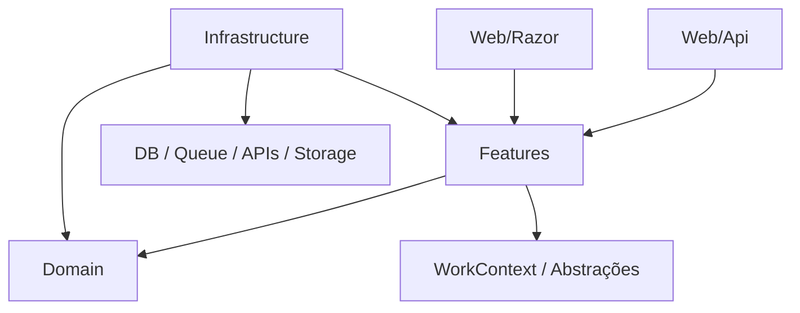

# Arquitetura Modular com Vertical Features

**Versão:** 1.0  
**Formato:** artigo/tutorial de referência  
**Contexto:** arquitetura .NET/C# modular, pragmática, orientada a domínio, features, produtividade e agentes de IA.

---

## 1. Visão geral

Esta arquitetura combina quatro ideias principais:

1. **Modularidade por domínio**  
   O sistema é dividido em módulos de negócio. Cada módulo representa, idealmente, um **Bounded Context** do DDD ou uma capability de negócio suficientemente autônoma.

2. **DDD no núcleo interno**  
   Cada módulo possui um núcleo interno composto por regras de domínio e casos de uso. O domínio concentra invariantes, entidades, value objects, eventos, policies e serviços de domínio. As features concentram operações, comandos, queries, contratos operacionais, validação, modelos de saída e orquestração.

3. **Hexagonal Architecture como princípio, não como nomenclatura física**  
   A arquitetura usa os conceitos de interno/externo, entrada/saída e inversão de dependência, mas evita nomes físicos como `Ports`, `Driving`, `Driven` e `Adapters`. Esses termos ajudam a pensar, mas não precisam virar pastas principais.

4. **Vertical Application Slices**  
   O sistema é implementado por features/casos de uso. Uma feature deve manter próximos os artefatos que mudam juntos: intenção, modelo de entrada, validação, handler/comando, modelo de saída, busca, filtros e metadados de endpoint quando isso for produtivo.

Uma descrição curta:

> Arquitetura modular baseada em Bounded Contexts, com domínio explícito ou gritante, features verticais, entradas web organizadas por tecnologia, infraestrutura pragmática e princípios hexagonais aplicados sem dogmatismo.

---

## 2. Nome proposto

O nome conceitual recomendado é:

> **Modular DDD + Hexagonal Architecture + Vertical Application Slices**

Uma versão curta para documentação interna pode ser:

> **Modular DDD com Vertical Features**

O nome completo é útil porque deixa claro que a arquitetura não é apenas Clean Architecture, nem apenas Vertical Slice Architecture, nem apenas DDD. Ela combina essas ideias em uma forma adaptada para .NET, Source Generators, SmartCommands, WorkContext, SmartSearch, SmartSelector, SmartProblems e agentes de IA.

---

## 3. Problema que a arquitetura tenta resolver

Arquiteturas .NET costumam cair em dois extremos.

### 3.1 Excesso de camadas

Exemplo típico:

```text
Controller
  -> Mediator
    -> CommandHandler
      -> Service
        -> Repository Interface
          -> Repository Implementation
            -> DbContext
              -> Entity
                -> Mapper
                  -> DTO
```

Esse modelo pode ser justificável em sistemas complexos, mas muitas vezes vira cerimônia. Para CRUD e casos de uso simples, há arquivos demais, indireção demais e pouca clareza de negócio.

### 3.2 Vertical Slice solta demais

O outro extremo é colocar tudo dentro da feature sem proteção real de domínio:

```text
Features/
  CreateOrder/
    Endpoint.cs
    Handler.cs
    Request.cs
    Response.cs
```

Isso é simples e produtivo, mas pode gerar:

- regras duplicadas;
- handlers gigantes;
- domínio anêmico;
- falta de fronteiras entre módulos;
- acoplamento oculto;
- pouca governança sobre consistência e invariantes.

### 3.3 O meio termo proposto

A proposta é manter:

- a produtividade de features verticais;
- a clareza de módulos de negócio;
- a proteção de domínio do DDD;
- a separação conceitual da arquitetura hexagonal;
- a liberdade pragmática de .NET moderno;
- a capacidade de gerar, revisar e manter código com IA.

---

## 4. Regra central

A regra central é:

> **Módulo é a unidade de negócio. Feature é a unidade operacional. Domain é a unidade de regra. Infrastructure é a unidade técnica. Web é a unidade de entrada.**

Em forma estrutural:

```text
Module/
  Domain/
  Features/
  Web/
  Infrastructure/
```

Essa estrutura base é válida tanto para a variante **explícita** quanto para a variante **gritante**. A diferença está em onde o domínio aparece e como os aggregates ficam visíveis.

---

## 5. Estrutura de solução recomendada

Uma solução completa pode ser organizada assim:

```text
Company.Solution/
  src/
    Apps/
      Company.Solution.Api/
      Company.Solution.Web/

    Modules/
      Company.Solution.Products/
      Company.Solution.Sales/
      Company.Solution.Billing/
      Company.Solution.Identity/

    Common/
      Company.Solution.Common/
      Company.Solution.EfMigrations/

  tests/
    Company.Solution.UnitTests/
    Company.Solution.IntegrationTests/
    Company.Solution.ArchitectureTests/

  docs/
    architecture.md
```

### 5.1 `Apps`

Contém aplicações executáveis:

```text
Apps/
  Company.Solution.Api/
  Company.Solution.Web/
  Company.Solution.Worker/
```

Exemplos:

- API ASP.NET Core;
- Blazor Server ou Blazor Web App;
- worker;
- CLI;
- host modular;
- aplicação web principal.

### 5.2 `Modules`

Contém os módulos de negócio:

```text
Modules/
  Company.Solution.Products/
  Company.Solution.Orders/
  Company.Solution.Billing/
```

Cada módulo deve ser suficientemente autônomo e representar uma fronteira conceitual clara.

### 5.3 `Common`

Contém código compartilhado que não pertence a um módulo específico:

```text
Common/
  Company.Solution.Common/
  Company.Solution.EfMigrations/
```

Use com cuidado para não criar uma gaveta global.

### 5.4 `Tests`

Contém testes unitários, integração e arquitetura:

```text
tests/
  Company.Solution.UnitTests/
  Company.Solution.IntegrationTests/
  Company.Solution.ArchitectureTests/
```

---

## 6. Estrutura interna de um módulo

Estrutura base:

```text
{Company}.{Solution}.{Module}/
  Domain/
  Features/
  Web/
  Infrastructure/
```

Existem duas variações válidas.

### 6.1 Variante explícita

Na variante explícita, inspirada pela **Explicit Architecture** de Herberto Graça, o domínio aparece como uma pasta de primeira classe na raiz do módulo:

```text
{Company}.{Solution}.{Module}/
  Domain/
  Features/
  Web/
  Infrastructure/
```

Estrutura expandida válida:

```text
{Company}.{Solution}.{Module}/
  Domain/
    {Aggregate}s/
    Support/
    Commons/

  Features/
    {Aggregate}s/
      Commons/
      {Feature}/
    {Feature}/

  Web/
    Api/
    Razor/

  Infrastructure/
    Data/
    Searches/
    Messaging/
    Gateways/
    Security/
```

### 6.2 Variante gritante

Na variante gritante, inspirada pela **Screaming Architecture** de Robert C. Martin, a navegação grita o domínio primeiro. O aggregate é o agrupador principal dentro de `Features`, e o domínio aparece dentro desse aggregate:

```text
{Company}.{Solution}.{Module}/
  Features/
    {Aggregate}s/
      Domain/
      Commons/
      {Feature}/
    {Feature}/

  Web/
    Api/
    Razor/

  Infrastructure/
    Data/
    Searches/
    Messaging/
    Gateways/
    Security/
```

Essa variante é útil quando a equipe quer que a árvore do projeto mostre primeiro a linguagem de negócio e depois as responsabilidades técnicas.

### 6.3 Estrutura expandida inválida

Evite quebrar `Domain` primeiro por tipos de objetos:

```text
Domain/
  Entities/
  ValueObjects/
  Services/
  Events/
  Policies/
```

Essa estrutura organiza por classificação técnica, não por linguagem de negócio. Ela espalha o aggregate em várias pastas e dificulta entender quais conceitos mudam juntos.

A quebra recomendada em `Domain` é por aggregate, no plural:

```text
Domain/
  Products/
  Catalogs/
  Prices/
  Support/
  Commons/
```

Dentro da pasta do aggregate, os arquivos podem conter entidades, value objects, policies, serviços de domínio e eventos relacionados a esse aggregate.

### 6.4 Como escolher a variação

Use a variante explícita quando:

- a equipe prefere fronteiras técnicas visíveis;
- o domínio precisa ser encontrado rapidamente como camada interna;
- há muitos casos de uso por aggregate;
- os testes arquiteturais falam em `Domain`, `Features`, `Web` e `Infrastructure`.

Use a variante gritante quando:

- a equipe prefere navegação por linguagem de negócio;
- cada aggregate tem domínio e operações muito próximos;
- o módulo é grande e a árvore por aggregate reduz o salto entre pastas;
- a intenção é que a estrutura grite o domínio antes da camada.

Ambas são válidas. A escolha deve ser por módulo ou por solução, não por arquivo isolado.

---

## 7. `Domain`

`Domain` contém o modelo de domínio do módulo.

Ele deve conter:

- aggregates;
- entidades;
- value objects;
- eventos de domínio;
- serviços de domínio;
- policies;
- regras de invariância;
- comportamentos de negócio.

### 7.1 Estrutura de `Domain` na variante explícita

Exemplo:

```text
MyCompany.MySolution.Products/
  Domain/
    Products/
      Product.cs
      ProductCode.cs
      ProductName.cs
      ProductPrice.cs
      ProductStatus.cs
      ProductPricingService.cs
      ProductActivationPolicy.cs
      Events/
        ProductCreated.cs
        ProductPriceChanged.cs
```

`Products` é o aggregate em plural. A pasta reúne os tipos que descrevem e protegem esse aggregate.

Quando houver conceitos que atravessam mais de um aggregate do módulo, use `Support/` ou `Commons/`:

```text
Domain/
  Products/
  Prices/
  Support/
    Money.cs
    Currency.cs
  Commons/
    DomainClock.cs
```

Não transforme `Support` ou `Commons` em uma área genérica sem dono. Se o tipo começa a pertencer claramente a um aggregate, mova-o para o aggregate.

### 7.2 Estrutura de domínio na variante gritante

Exemplo:

```text
MyCompany.MySolution.Products/
  Features/
    Products/
      Domain/
        Product.cs
        ProductCode.cs
        ProductName.cs
        ProductPrice.cs
        ProductStatus.cs
        ProductPricingService.cs
        ProductActivationPolicy.cs
      Events/
        ProductCreated.cs
        ProductPriceChanged.cs
```

Nessa forma, a pasta `Products` é o ponto principal de navegação. `Domain/` e as features do aggregate ficam próximas.

Eventos continuam sendo artefatos de domínio. Se a equipe preferir, `Events/` pode ficar dentro de `Domain/`; se ficar como pasta irmã de `Domain/`, deve continuar dentro do aggregate e seguir as mesmas regras de dependência do domínio.

### 7.3 O que pertence ao domínio

Pertence ao domínio:

- regra que deve continuar existindo mesmo se a API mudar;
- invariantes de entidade/agregado;
- validações conceituais que não são apenas validações de formulário;
- transições de estado;
- eventos de domínio;
- cálculo de valores de negócio;
- policies que expressam linguagem do domínio.

Exemplo conceitual:

```csharp
public sealed class Product : AggregateRoot<Guid>
{
    public ProductCode Code { get; private set; }
    public ProductName Name { get; private set; }
    public ProductPrice Price { get; private set; }
    public ProductStatus Status { get; private set; }

    public Result ChangePrice(ProductPrice newPrice)
    {
        if (Status == ProductStatus.Inactive)
            return Problems.InvalidState("Inactive products cannot have their price changed.");

        Price = newPrice;
        AddDomainEvent(new ProductPriceChanged(Id, newPrice));

        return Result.Ok();
    }
}
```

### 7.4 O que não pertence ao domínio

Não pertence ao domínio:

- endpoint HTTP;
- atributo de rota;
- EF Core mapping;
- envio de e-mail;
- chamada a API externa;
- query de tela;
- paginação de grid;
- DTO específico de API;
- serialização JSON;
- lógica de autenticação de framework;
- código de infraestrutura.

---

## 8. `Features`

`Features` substitui a separação rígida entre `Application` e `Contracts` para contratos operacionais.

A ideia é que uma feature contenha os artefatos operacionais do caso de uso:

- intenção;
- comando ou query;
- contrato de entrada;
- modelo de saída;
- validação;
- filtros;
- metadados HTTP quando adequado;
- resultados;
- modelos de tela/API;
- pequenos mapeamentos associados à operação.

### 8.1 Organização por aggregate

O padrão recomendado é organizar features por aggregate:

```text
{Company}.{Solution}.{Module}/
  Features/
    Products/
      Commons/
        CreateProduct.cs
        GetProductDetails.cs
        UpdateProduct.cs
        ProductDetails.cs
        ProductFilters.cs
        ProductSummary.cs
        SearchProducts.cs
      ChangePrice/
        ChangeProductPrice.cs
        ChangeProductPriceHandler.cs
        IChangeProductPriceHandler.cs

    {Feature}/
```

As operações mais CRUD-like e contratos comuns do aggregate ficam em `Commons/`.

Exemplos de `Commons/`:

- `CreateProduct`;
- `UpdateProduct`;
- `GetProductDetails`;
- `SearchProducts`;
- `ProductDetails`;
- `ProductSummary`;
- `ProductFilters`.

Features que representam intenção de negócio e não são apenas CRUD-like devem ganhar uma pasta dedicada:

```text
Features/
  Products/
    ChangePrice/
      ChangeProductPrice.cs
      ChangeProductPriceHandler.cs
      IChangeProductPriceHandler.cs

    Discontinue/
      DiscontinueProduct.cs
      DiscontinueProductHandler.cs
```

Features que representam uma intenção do módulo, mas não são operação de um aggregate específico, podem ficar direto em `Features/`:

```text
Features/
  RebuildCatalogIndex/
    RebuildCatalogIndex.cs
    RebuildCatalogIndexHandler.cs
```

### 8.2 Variante explícita e gritante nas features

Para a camada de aplicação, não há mudança essencial entre a variante explícita e a variante gritante. A diferença é a localização do domínio.

Explícita:

```text
Products/
  Domain/
    Products/

  Features/
    Products/
      Commons/
      ChangePrice/
```

Gritante:

```text
Products/
  Features/
    Products/
      Domain/
      Commons/
      ChangePrice/
```

Em ambos os casos, as features continuam sendo organizadas por aggregate e intenção.

### 8.3 Por que juntar `Application` e `Contracts`

Em muitas arquiteturas, `Application` contém comandos e handlers, enquanto `Contracts` contém request/response DTOs. Isso é válido, mas pode ser artificial quando o contrato é operacional e existe apenas para aquele caso de uso.

Um `CreateProduct` pode ser, ao mesmo tempo:

- a intenção do caso de uso;
- o comando;
- o contrato operacional de entrada;
- a unidade de validação;
- a fonte de metadados para geração de handler;
- a fonte de metadados HTTP;
- a peça principal da feature.

Portanto, em vez de:

```text
Application/
  UseCases/
    CreateProduct/
      CreateProductCommand.cs

Contracts/
  CreateProductRequest.cs
  CreateProductResponse.cs
```

usa-se:

```text
Features/
  Products/
    Commons/
      CreateProduct.cs
      ProductDetails.cs
```

### 8.4 Nomenclatura de modelos

Não crie `Request`, `Response`, `Command`, `Query` ou `Event` por reflexo. Prefira nomes semânticos.

Exemplos:

```text
CreateProduct
UpdateProduct
ChangeProductPrice
ProductDetails
ProductSummary
ProductModel
ProductViewModel
ProductFilters
```

Diretrizes:

| Nome | Quando usar |
|---|---|
| `CreateProduct` | intenção/comando de criação |
| `UpdateProduct` | intenção/comando de alteração comum |
| `ChangeProductPrice` | intenção de negócio específica |
| `GetProductDetails` | intenção de leitura detalhada |
| `SearchProducts` | intenção de busca/listagem |
| `ProductDetails` | visão detalhada de produto |
| `ProductSummary` | visão resumida/listagem |
| `ProductFilters` | filtros de busca |
| `ProductViewModel` | modelo claramente orientado à UI |

Use sufixos técnicos apenas quando eles resolverem uma ambiguidade real. Eventos de domínio podem ter nomes de fato ocorrido, como `ProductCreated` e `ProductPriceChanged`.

---

## 9. Comandos, queries e features

Uma feature pode representar escrita ou leitura.

### 9.1 Feature de comando

Estrutura:

```text
Features/
  Products/
    Commons/
      CreateProduct.cs
      ProductDetails.cs
```

Exemplo ilustrativo com SmartCommands, SmartProblems e SmartValidations:

```csharp
[MapPost("/products", "CreateProduct")]
[MapGroup("Products")]
[WithSummary("Create product")]
public sealed partial class CreateProduct
{
    public string Code { get; init; } = default!;
    public string Name { get; init; } = default!;
    public decimal Price { get; init; }

    public bool HasProblems(out Problems? problems)
    {
        return Rules.Set<CreateProduct>()
            .NotEmpty(Code)
            .NotEmpty(Name)
            .GreaterThanOrEqual(Price, 0)
            .HasProblems(out problems);
    }

    [Command, WithValidateModel, WithWorkContext]
    public Result<ProductDetails> Execute(IWorkContext workContext)
    {
        var code = ProductCode.Create(Code);
        var name = ProductName.Create(Name);
        var price = ProductPrice.Create(Price);

        var product = Product.Create(code, name, price);

        workContext.Repository<Product>().Add(product);

        return ProductDetails.From(product);
    }
}
```

### 9.2 Feature de query

Estrutura:

```text
Features/
  Products/
    Commons/
      GetProductDetails.cs
      ProductDetails.cs
```

Exemplo ilustrativo:

```csharp
[MapGet("/products/{id:guid}", "GetProductDetails")]
[MapGroup("Products")]
public sealed partial class GetProductDetails
{
    public Guid Id { get; init; }

    [Command]
    public async Task<FindResult<ProductDetails>> ExecuteAsync(
        IWorkContext workContext,
        CancellationToken cancellationToken)
    {
        return await workContext
            .Repository<Product>()
            .Query()
            .Where(product => product.Id == Id)
            .SelectProductDetails()
            .TryFindAsync(cancellationToken);
    }
}
```

### 9.3 Feature de busca

Estrutura:

```text
Features/
  Products/
    Commons/
      SearchProducts.cs
      ProductFilters.cs
      ProductSummary.cs
```

Nesse caso, a feature pode usar SmartSearch, Filter-Specifier e SmartSelector.

```csharp
public sealed class ProductFilters
{
    [Criterion]
    public string? Name { get; init; }

    [Criterion]
    public ProductStatus? Status { get; init; }
}

[AutoSelect<Product>, AutoProperties]
public sealed partial class ProductSummary
{
}
```

A intenção da busca fica em `Features`. A implementação técnica pesada, quando existir, fica em `Infrastructure/Searches`.

---

## 10. HTTP dentro de `Features`

A arquitetura permite metadados HTTP na feature quando isso aumenta produtividade e não compromete clareza.

Exemplo:

```csharp
[MapPost("/products", "CreateProduct")]
public sealed partial class CreateProduct
{
    [Command, WithValidateModel, WithWorkContext]
    public Result<ProductDetails> Execute(IWorkContext workContext)
    {
        // ...
    }
}
```

Essa abordagem combina com Vertical Slice porque mantém perto:

- entrada;
- validação;
- caso de uso;
- retorno;
- metadados de endpoint.

### 10.1 Quando usar attributes HTTP na feature

Use quando:

- endpoint é simples;
- contrato de entrada é igual ao comando;
- rota é direta;
- autorização é simples;
- não há versionamento complexo;
- não há upload/streaming;
- a produtividade é mais importante que separação estrita;
- o padrão do projeto é usar SmartCommands para mapear endpoints.

### 10.2 Quando mapear endpoint manualmente

Use `Web/Api` com mapeamento tradicional quando:

- attributes não expressam bem o endpoint;
- há múltiplas rotas para o mesmo caso de uso;
- há versionamento complexo;
- existe upload/download;
- há streaming;
- autorização é dinâmica;
- endpoint compõe múltiplas features;
- o contrato HTTP difere do comando;
- API pública exige controle explícito;
- a geração automática limita o design.

Exemplo:

```csharp
public static class ProductApi
{
    public static IEndpointRouteBuilder MapProductApi(this IEndpointRouteBuilder app)
    {
        var group = app.MapGroup("/products")
            .WithTags("Products");

        group.MapPost("/", async (
            CreateProduct command,
            ICreateProductHandler handler,
            CancellationToken cancellationToken) =>
        {
            var result = await handler.HandleAsync(command, cancellationToken);
            return result.ToHttpResult();
        });

        return app;
    }
}
```

---

## 11. `Web`

`Web` contém mecanismos de entrada relacionados à web.

Estrutura recomendada:

```text
Web/
  Api/
  Razor/
```

### 11.1 `Web/Api`

Contém:

- grupos de rotas;
- endpoint mappings;
- endpoints manuais;
- configuração de API;
- extensões `Map...`;
- documentação OpenAPI específica;
- código HTTP que não cabe bem em attributes.

Exemplo:

```text
Web/
  Api/
    ProductApi.cs
    ProductEndpointMappings.cs
```

### 11.2 `Web/Razor`

Contém:

- componentes Razor;
- páginas Blazor;
- componentes reutilizáveis do módulo;
- modelos específicos da UI, quando necessário.

Exemplo:

```text
Web/
  Razor/
    ProductList.razor
    ProductEditor.razor
    ProductDetailsPanel.razor
```

Em sistemas backend-only, `Web/Razor` simplesmente não existe.

### 11.3 Blazor e separação de projeto

Componentes Razor/Blazor podem ficar dentro do módulo, mas isso deve ser avaliado caso a caso.

| Cenário | Recomendação |
|---|---|
| Backend-only | sem `Web/Razor` |
| Blazor Server / Blazor Web App server-side | `Web/Razor` pode ficar no módulo |
| Blazor WASM pequeno/admin | pode ficar no módulo, validando payload |
| Blazor WASM público/grande | separar Razor/Contracts em projeto próprio |
| Frontend independente | contratos próprios ou projeto de contratos compartilhado |

Estrutura com WASM separado:

```text
Company.Solution.Products/
  Domain/
  Features/
  Web/
    Api/
  Infrastructure/

Company.Solution.Products.Razor/
  Components/
  Pages/
  Models/
```

---

## 12. `Infrastructure`

`Infrastructure` contém implementações técnicas usadas pelo módulo.

Exemplo:

```text
Infrastructure/
  Data/
    ModuleDbContext.cs
    ProductMapping.cs
    Migrations/

  Searches/
    ProductSearchMapping.cs

  Messaging/
    ProductCreatedPublisher.cs
    ProductUpdatedConsumer.cs

  Gateways/
    PaymentGatewayClient.cs
    ErpProductClient.cs

  Security/
    ProductAuthorizationService.cs

  Storage/
    ProductImageStorage.cs
```

`Gateways` é o nome preferencial para classes que acessam serviços externos. `ExternalServices` também é aceitável quando a solução já usa essa nomenclatura. Escolha uma convenção e mantenha-a consistente.

### 12.1 O que pertence à infraestrutura

Pertence à infraestrutura:

- EF Core mappings;
- DbContext;
- acesso físico a banco;
- mensageria;
- integração externa;
- cache;
- storage;
- e-mail;
- API clients;
- autenticação/autorização de infraestrutura;
- implementação técnica de buscas;
- indexação;
- event publishing;
- filas;
- outbox/inbox;
- serviços específicos de cloud.

### 12.2 O que não pertence à infraestrutura

Não pertence à infraestrutura:

- regra de domínio;
- invariante de entidade;
- decisão de caso de uso;
- contrato principal da feature;
- modelo conceitual de comando/query.

---

## 13. WorkContext

`WorkContext` é a abstração pragmática padrão para persistência, unidade de trabalho, buscas, commands e queries no ecossistema RoyalCode.

Ele pode encapsular:

- Unit of Work;
- Repository;
- consultas;
- comandos;
- busca;
- integração com EF Core;
- convenções do módulo.

### 13.1 Visão pragmática

Esta arquitetura não busca pureza hexagonal absoluta. Ela usa princípios hexagonais para orientar fronteiras, mas aceita abstrações de plataforma quando elas reduzem boilerplate e aumentam consistência.

Portanto:

> `WorkContext` pode funcionar como a abstração padrão de acesso a dados do módulo.

### 13.2 Quando usar `WorkContext` diretamente

Use quando:

- a operação é comum;
- o padrão da solução já é RoyalCode;
- a abstração reduz código;
- não há múltiplas implementações;
- a feature não precisa esconder completamente a persistência;
- a produtividade é prioridade.

### 13.3 Quando criar interface específica

Crie abstração específica quando:

- houver integração externa;
- houver múltiplas implementações;
- a dependência expressar linguagem de domínio;
- o caso de uso precisar de contrato conceitual forte;
- a operação não for bem representada pelo WorkContext;
- o módulo não puder conhecer detalhes de plataforma;
- a regra precisa ser isolada para testes/variações.

Exemplo:

```csharp
public interface IPaymentGateway
{
    Task<PaymentResult> ChargeAsync(PaymentRequest request, CancellationToken cancellationToken);
}
```

Implementação:

```text
Infrastructure/
  Gateways/
    StripePaymentGateway.cs
```

---

## 14. SmartCommands, Results e validação

SmartCommands é adequado para essa arquitetura porque uma classe de feature pode declarar:

- o contrato operacional;
- validação via `HasProblems`;
- método de comando com `[Command]`;
- decorators quando necessário;
- Unit of Work ou WorkContext;
- metadados HTTP para Minimal APIs.

### 14.1 Fluxo esperado

Em vez de usar exceções para fluxo esperado:

```text
validação falha
regra de negócio impede operação
entidade não encontrada
permissão insuficiente
```

use:

```text
Problem
Problems
Result
Result<T>
FindResult
```

### 14.2 Validação

SmartValidations permite validar comandos, DTOs e value objects com `RuleSet` e `HasProblems(out Problems?)`.

Diretriz:

> Validações esperadas não devem lançar exceções. Elas devem retornar `Problems` ou `Result`.

### 14.3 Exceções

Exceções devem ser reservadas para falhas excepcionais ou bugs inesperados. Falhas de domínio, validação, estado inválido e não encontrado devem ser modeladas com `Problems` e propagadas por `Result`.

---

## 15. Searches, Filter-Specifier e Selectors

A arquitetura não usa `Specification` clássico como pasta padrão.

Em vez disso, adota os padrões do ecossistema RoyalCode:

- Searches;
- Filters;
- Filter-Specifier;
- Selectors;
- SmartSearch;
- SmartSelector.

### 15.1 Diferença conceitual

`Specification` costuma ser um padrão para encapsular predicados/regras reutilizáveis.

`Filter-Specifier`, neste contexto, é mais orientado a:

- composição de filtros;
- busca;
- paginação;
- ordenação;
- projeção;
- tradução para LINQ/EF;
- comportamento de listagem e consulta.

### 15.2 Onde colocar

Para uma busca simples:

```text
Features/
  Products/
    Commons/
      SearchProducts.cs
      ProductFilters.cs
      ProductSummary.cs
```

Para infraestrutura de busca mais complexa:

```text
Infrastructure/
  Searches/
    ProductSearchMapping.cs
    ProductSelector.cs
```

Regra:

> A intenção da busca fica em `Features`. A implementação técnica pesada pode ficar em `Infrastructure/Searches`.

SmartSelector deve ser usado para modelos como `Details` e `Summary` quando a projeção puder ser gerada e mantida de forma segura:

```csharp
[AutoSelect<Product>, AutoProperties]
public sealed partial class ProductSummary
{
}
```

---

## 16. Fronteiras conceituais hexagonais sem nomenclatura hexagonal

A arquitetura usa Hexagonal Architecture como princípio, mas não como nomenclatura física.

### 16.1 Conceitos

| Conceito hexagonal | Nome físico recomendado |
|---|---|
| Driving Adapter | `Web/Api`, `Web/Razor`, `Consumers`, `Jobs`, `Cli` |
| Driven Adapter | `Infrastructure/Data`, `Infrastructure/Messaging`, `Infrastructure/Gateways`, `Infrastructure/Storage` |
| Port | `Gateways`, `Providers`, abstrações específicas ou abstrações de plataforma como `WorkContext` |
| Application Core | `Domain` + `Features` |
| Adapter | nome técnico concreto, como `EfCore`, `RabbitMq`, `SendGrid`, `S3`, `Redis` |

### 16.2 Regra de nomenclatura

Não use como nomes principais de pasta:

```text
Ports/
Driving/
Driven/
Adapters/
```

Prefira nomes concretos:

```text
Web/Api/
Web/Razor/
Infrastructure/Data/
Infrastructure/Messaging/
Infrastructure/Gateways/
Features/
Domain/
```

### 16.3 Por quê?

Porque nomes como `Driving` e `Driven` são úteis para arquitetos, mas ruins para navegação diária.

O desenvolvedor quer achar:

- endpoints;
- componentes Razor;
- queries;
- persistência;
- mensageria;
- integração externa.

Ele não quer traduzir termos acadêmicos a cada navegação.

---

## 17. Dependências permitidas

Em um módulo com um único projeto, as regras precisam ser mantidas por disciplina e testes de arquitetura.

Conceitualmente:

```text
Domain
  não depende de Features, Web ou Infrastructure

Features
  pode depender de Domain
  pode depender de abstrações de plataforma aprovadas
  não deve depender de Web
  não deve depender de implementação concreta de Infrastructure, salvo decisão pragmática documentada

Web
  pode depender de Features
  pode depender de modelos da feature
  não deve conter regra de domínio

Infrastructure
  pode depender de Domain
  pode depender de Features quando implementar algo solicitado por feature
  não deve conter regra de domínio
```

Diagrama conceitual:



Regra prática:

> O domínio deve ser o ponto mais estável do módulo.  
> Features orquestram o uso do domínio.  
> Web aciona features.  
> Infrastructure implementa detalhes técnicos.

---

## 18. Um projeto por módulo

A proposta base usa um projeto C# por módulo.

Exemplo:

```text
Company.Solution.Products/
  Domain/
  Features/
  Web/
  Infrastructure/
```

### 18.1 Vantagens

- menos projetos;
- build mais simples;
- navegação mais fácil;
- bom para Codex/Copilot;
- menor overhead;
- boa ergonomia para modular monolith.

### 18.2 Desvantagens

- C# não impede `Domain` de referenciar `Infrastructure`;
- fronteiras dependem de disciplina;
- precisa de testes arquiteturais;
- código pode se misturar se não houver regras.

### 18.3 Quando dividir em mais projetos

Separe em projetos quando:

- Blazor WASM exige payload controlado;
- módulo é muito grande;
- domínio precisa ser empacotado isoladamente;
- contratos precisam ser compartilhados com cliente externo;
- infraestrutura tem dependências pesadas;
- há necessidade de enforcing por compilação;
- módulo será extraído como serviço independente;
- equipe precisa de fronteiras fortes.

Exemplo:

```text
Company.Solution.Products/
Company.Solution.Products.Razor/
Company.Solution.Products.Contracts/
Company.Solution.Products.Infrastructure/
```

Essa separação deve ser exceção motivada, não ponto de partida obrigatório.

---

## 19. CQS, CQRS e níveis de sofisticação

A arquitetura permite diferentes níveis.

### 19.1 Nível 1: Feature direta

```text
Web/Api -> Feature -> WorkContext/Domain
```

Bom para CRUD e casos simples.

### 19.2 Nível 2: CQS leve

Separar comandos e queries, mas sem infraestrutura complexa:

```text
Features/
  Products/
    Commons/
      CreateProduct.cs
      UpdateProduct.cs
      GetProductDetails.cs
      SearchProducts.cs
```

### 19.3 Nível 3: CQS com handlers gerados

Usar SmartCommands para gerar handlers, validação, unit of work e mapeamento:

```text
CreateProduct.cs
  -> generated handler
  -> validation
  -> unit of work
  -> result/problems
```

### 19.4 Nível 4: CQRS mais forte

Use quando houver motivo real:

- read models separados;
- projeções;
- eventos;
- consistência eventual;
- filas;
- outbox/inbox;
- múltiplos modelos de leitura;
- alta escala;
- módulos desacoplados.

Estrutura possível:

```text
Features/
  Products/
    Commands/
      CreateProduct/
      UpdateProduct/

    Queries/
      GetProductDetails/
      SearchProducts/

Infrastructure/
  Projections/
  ReadModels/
  Messaging/
  Outbox/
```

Regra:

> Comece simples. Evolua para CQRS forte apenas quando a complexidade justificar.

---

## 20. Comunicação entre módulos

Módulos não devem acessar internamente o domínio de outros módulos de forma livre.

### 20.1 Formas aceitáveis

1. Eventos de integração
2. APIs internas
3. Contratos públicos estáveis
4. Shared Kernel mínimo
5. Serviços de aplicação explicitamente expostos
6. Read models/projeções locais

### 20.2 Evitar

Evite:

```text
Products.Domain.Product acessado diretamente por Billing
Billing mexendo no DbContext de Sales
Um módulo usando entidades internas de outro módulo
SharedKernel gigante
```

### 20.3 Regra

> Um módulo pode usar informação de outro módulo, mas não deve modificar dados que outro módulo possui sem passar por contrato explícito.

---

## 21. Shared Kernel

`SharedKernel` deve ser pequeno e estável.

Pode conter:

- `Result`;
- `Problem`;
- `Entity`;
- `ValueObject`;
- `DomainEvent`;
- tipos básicos de domínio amplamente usados;
- abstrações realmente universais;
- utilitários essenciais.

Não deve conter:

- regra específica de produto;
- lógica de módulo;
- DTOs de feature;
- serviços de aplicação;
- helpers genéricos demais;
- dependências pesadas.

Regra:

> Se algo muda por causa de um módulo específico, provavelmente não pertence ao Shared Kernel.

---

## 22. Exemplo completo: módulo de Produtos

### 22.1 Variante explícita

```text
Company.Solution.Products/
  Domain/
    Products/
      Product.cs
      ProductCode.cs
      ProductName.cs
      ProductPrice.cs
      ProductStatus.cs
      ProductPricingService.cs
      ProductActivationPolicy.cs
      Events/
        ProductCreated.cs
        ProductPriceChanged.cs

  Features/
    Products/
      Commons/
        CreateProduct.cs
        UpdateProduct.cs
        GetProductDetails.cs
        SearchProducts.cs
        ProductDetails.cs
        ProductSummary.cs
        ProductFilters.cs

      ChangePrice/
        ChangeProductPrice.cs
        ChangeProductPriceHandler.cs
        IChangeProductPriceHandler.cs

    RebuildCatalogIndex/
      RebuildCatalogIndex.cs

  Web/
    Api/
      ProductApi.cs
      ProductEndpointMappings.cs

    Razor/
      ProductList.razor
      ProductEditor.razor

  Infrastructure/
    Data/
      ProductMapping.cs
      ProductDbContextExtensions.cs

    Searches/
      ProductSearchMapping.cs

    Messaging/
      ProductCreatedPublisher.cs

    Gateways/
      ErpProductGateway.cs
```

### 22.2 Variante gritante

```text
Company.Solution.Products/
  Features/
    Products/
      Domain/
        Product.cs
        ProductCode.cs
        ProductName.cs
        ProductPrice.cs
        ProductStatus.cs
        ProductPricingService.cs
        ProductActivationPolicy.cs
      Events/
        ProductCreated.cs
        ProductPriceChanged.cs

      Commons/
        CreateProduct.cs
        UpdateProduct.cs
        GetProductDetails.cs
        SearchProducts.cs
        ProductDetails.cs
        ProductSummary.cs
        ProductFilters.cs

      ChangePrice/
        ChangeProductPrice.cs
        ChangeProductPriceHandler.cs
        IChangeProductPriceHandler.cs

    RebuildCatalogIndex/
      RebuildCatalogIndex.cs

  Web/
    Api/
      ProductApi.cs
      ProductEndpointMappings.cs

    Razor/
      ProductList.razor
      ProductEditor.razor

  Infrastructure/
    Data/
      ProductMapping.cs
      ProductDbContextExtensions.cs

    Searches/
      ProductSearchMapping.cs

    Messaging/
      ProductCreatedPublisher.cs

    Gateways/
      ErpProductGateway.cs
```

### 22.3 Domínio

```csharp
public sealed class Product : AggregateRoot<Guid>
{
    public ProductCode Code { get; private set; }
    public ProductName Name { get; private set; }
    public ProductPrice Price { get; private set; }
    public ProductStatus Status { get; private set; }

    private Product()
    {
    }

    public static Product Create(ProductCode code, ProductName name, ProductPrice price)
    {
        var product = new Product
        {
            Id = Guid.NewGuid(),
            Code = code,
            Name = name,
            Price = price,
            Status = ProductStatus.Active
        };

        product.AddDomainEvent(new ProductCreated(product.Id));

        return product;
    }

    public Result ChangePrice(ProductPrice price)
    {
        if (Status == ProductStatus.Inactive)
            return Problems.InvalidState("Inactive products cannot have their price changed.");

        Price = price;
        AddDomainEvent(new ProductPriceChanged(Id, price));

        return Result.Ok();
    }
}
```

### 22.4 Feature de criação

```csharp
[MapPost("/products", "CreateProduct")]
[MapGroup("Products")]
[WithSummary("Create product")]
public sealed partial class CreateProduct
{
    public string Code { get; init; } = default!;
    public string Name { get; init; } = default!;
    public decimal Price { get; init; }

    public bool HasProblems(out Problems? problems)
    {
        return Rules.Set<CreateProduct>()
            .NotEmpty(Code)
            .NotEmpty(Name)
            .GreaterThanOrEqual(Price, 0)
            .HasProblems(out problems);
    }

    [Command, WithValidateModel, WithWorkContext]
    public Result<ProductDetails> Execute(IWorkContext workContext)
    {
        var product = Product.Create(
            ProductCode.Create(Code),
            ProductName.Create(Name),
            ProductPrice.Create(Price));

        workContext.Repository<Product>().Add(product);

        return ProductDetails.From(product);
    }
}
```

### 22.5 Modelo de saída

```csharp
[AutoSelect<Product>]
public sealed partial class ProductDetails
{
    public Guid Id { get; init; }
    public string Code { get; init; } = default!;
    public string Name { get; init; } = default!;
    public decimal Price { get; init; }
    public string Status { get; init; } = default!;

    public static ProductDetails From(Product product)
    {
        return new ProductDetails
        {
            Id = product.Id,
            Code = product.Code.Value,
            Name = product.Name.Value,
            Price = product.Price.Value,
            Status = product.Status.ToString()
        };
    }
}
```

### 22.6 Mapeamento manual opcional

```csharp
public static class ProductApi
{
    public static IEndpointRouteBuilder MapProductApi(this IEndpointRouteBuilder app)
    {
        var group = app.MapGroup("/products")
            .WithTags("Products");

        group.MapPost("/", async (
            CreateProduct command,
            ICreateProductHandler handler,
            CancellationToken cancellationToken) =>
        {
            var result = await handler.HandleAsync(command, cancellationToken);
            return result.ToHttpResult();
        });

        group.MapGet("/{id:guid}", async (
            Guid id,
            IGetProductDetailsHandler handler,
            CancellationToken cancellationToken) =>
        {
            var query = new GetProductDetails { Id = id };
            var result = await handler.HandleAsync(query, cancellationToken);
            return result.ToHttpResult();
        });

        return app;
    }
}
```

---

## 23. Comparação com Clean Architecture clássica

Clean Architecture clássica:

```text
Api/
Application/
Domain/
Infrastructure/
Contracts/
```

Organiza primeiro por camada.

Arquitetura proposta:

```text
Modules/
  Products/
    Domain/
    Features/
    Web/
    Infrastructure/
```

Organiza primeiro por módulo de negócio, depois por responsabilidades internas.

| Critério | Clean Architecture | Arquitetura proposta |
|---|---|---|
| Unidade principal | camada | módulo |
| Casos de uso | Application | Features |
| Contratos | Contracts separado | dentro de Features quando operacional |
| Entrada HTTP | Api global | Web/Api no módulo ou host |
| Domínio | central/global | por módulo ou por aggregate |
| Infraestrutura | global ou por projeto | por módulo |
| Risco | cerimônia horizontal | exige disciplina modular |
| IA/Codex | precisa navegar camadas | mais contexto local |

Conclusão:

> A proposta mantém o que há de bom na Clean Architecture, mas evita que a aplicação seja organizada primeiro por camadas globais.

---

## 24. Comparação com Vertical Slice Architecture pura

VSA pura:

```text
Features/
  CreateProduct/
    Endpoint.cs
    Request.cs
    Handler.cs
    Response.cs
```

Proposta:

```text
Products/
  Domain/
    Products/
  Features/
    Products/
      Commons/
        CreateProduct.cs
        ProductDetails.cs
  Web/
  Infrastructure/
```

| Critério | VSA pura | Arquitetura proposta |
|---|---|---|
| Organização por feature | sim | sim |
| Domínio explícito | opcional | sim |
| Bounded Context | nem sempre | sim |
| Infraestrutura separada | opcional | sim |
| Metadados HTTP na feature | comum | permitido |
| Risco | regra espalhada | menor |
| Produtividade | alta | alta |
| Governança | menor | maior |

Conclusão:

> A proposta usa slices verticais, mas preserva domínio e fronteira modular.

---

## 25. Comparação com Explicit Architecture e Screaming Architecture

A proposta é influenciada por:

- Eric Evans e Vaughn Vernon, pelo DDD e Bounded Contexts;
- Herberto Graça, pela Explicit Architecture;
- Robert C. Martin, pela Screaming Architecture;
- Jimmy Bogard, pela prática de vertical slices;
- RoyalCode, pelas bibliotecas de produtividade em .NET.

### 25.1 Explicit Architecture

A variante explícita capta a ideia de deixar responsabilidades arquiteturais visíveis:

```text
Domain/
Features/
Web/
Infrastructure/
```

Ela é boa quando a equipe valoriza leitura arquitetural rápida.

### 25.2 Screaming Architecture

A variante gritante deixa o domínio aparecer primeiro:

```text
Features/
  Products/
    Domain/
    Commons/
    ChangePrice/
```

Ela é boa quando a equipe valoriza navegação por negócio e quer que a estrutura grite o domínio.

### 25.3 Síntese

| Critério | Variante explícita | Variante gritante |
|---|---|---|
| Primeiro sinal visual | responsabilidade arquitetural | linguagem de negócio |
| Local do domínio | `Domain/{Aggregate}s` | `Features/{Aggregate}s/Domain` |
| Local das features | `Features/{Aggregate}s` | `Features/{Aggregate}s` |
| Melhor para | fronteiras claras por camada interna | navegação por aggregate |
| Risco | aggregate espalhado entre `Domain` e `Features` | regra arquitetural menos visível |

---

## 26. Comparação com a arquitetura anterior baseada em `Application` + `Contracts`

Estrutura anterior:

```text
Module/
  Contracts/
  Domain/
  Infrastructure/
  Application/
  Web/
```

Proposta:

```text
Module/
  Domain/
  Features/
  Web/
  Infrastructure/
```

Mudança principal:

```text
Application + Contracts -> Features
```

### 26.1 Benefícios

- menos ambiguidade;
- menos duplicação de modelos;
- melhor alinhamento com SmartCommands;
- melhor organização vertical;
- melhor para IA;
- menos sufixos artificiais;
- contratos operacionais ficam perto do caso de uso.

### 26.2 Cuidado

Quando um contrato for público, versionado ou compartilhado com frontend externo, pode precisar sair de `Features`.

Possíveis exceções:

```text
Module.Contracts/
  CreateProduct.cs
  ProductDetails.cs
```

ou:

```text
Module/
  PublicContracts/
```

Isso deve ser exceção motivada, não padrão.

---

## 27. Anti-patterns

### 27.1 Domain quebrado por tipo de objeto

```text
Domain/
  Entities/
  ValueObjects/
  Services/
  Events/
```

Correção:

```text
Domain/
  Products/
  Orders/
  Support/
```

### 27.2 Domain anêmico

```text
Domain/
  Products/
    Product.cs com apenas propriedades

Features/
  Products/
    ChangePrice/
      Handler com toda regra de negócio
```

Correção:

- mover invariantes e transições para entidades, value objects, policies ou serviços de domínio.

### 27.3 Feature gigante

```text
Features/
  Products/
    ManageProducts/
      ManageProducts.cs com tudo dentro
```

Correção:

- dividir por caso de uso real: `CreateProduct`, `UpdateProduct`, `ChangeProductPrice`, `SearchProducts`.

### 27.4 Infrastructure com regra de negócio

```text
Infrastructure/Data/ProductQuery.cs decide se produto pode ser ativado
```

Correção:

- regra de ativação deve ir para `Domain` ou `Features`.

### 27.5 SharedKernel inchado

```text
Common/
  Tudo.cs
```

Correção:

- manter Shared Kernel pequeno e estável.

### 27.6 Contratos genéricos demais

```text
ProductDto
ProductDto2
ProductRequest
ProductResponse
```

Correção:

- usar nomes semânticos: `ProductDetails`, `ProductSummary`, `CreateProduct`, `ChangeProductPrice`.

### 27.7 Dogmatismo hexagonal

```text
Ports/
Driving/
Driven/
Adapters/
```

Correção:

- usar os conceitos, mas nomear pastas de forma concreta.

### 27.8 WorkContext usado como desculpa para ignorar domínio

Correção:

- WorkContext facilita persistência, mas não substitui regras de domínio.

---

## 28. Critérios de decisão

### 28.1 Variante explícita ou gritante?

| Caso | Escolha |
|---|---|
| Equipe quer fronteiras técnicas claras | explícita |
| Equipe quer navegação por aggregate | gritante |
| Módulo pequeno | explícita tende a ser suficiente |
| Aggregate muito rico | gritante pode reduzir navegação |
| Testes arquiteturais por camada interna | explícita |
| Linguagem de negócio deve aparecer primeiro | gritante |

### 28.2 Attributes HTTP ou `Web/Api` manual?

| Caso | Escolha |
|---|---|
| CRUD simples | attributes na feature |
| endpoint direto | attributes na feature |
| API pública versionada | `Web/Api` manual |
| upload/download | `Web/Api` manual |
| autorização complexa | `Web/Api` manual |
| endpoint composto | `Web/Api` manual |
| máxima produtividade | attributes na feature |

### 28.3 Query em Feature ou Infrastructure?

| Caso | Escolha |
|---|---|
| query representa caso de uso | Feature |
| filtro/modelo de busca | Feature |
| projeção técnica complexa | `Infrastructure/Searches` |
| SQL otimizado ou provider-specific | `Infrastructure/Data` |
| regra de negócio | Domain/Feature, não Infrastructure |

### 28.4 Razor no módulo ou projeto separado?

| Caso | Escolha |
|---|---|
| Blazor Server | pode ficar no módulo |
| backend-only | não usar Razor |
| WASM pequeno/admin | pode ficar no módulo, avaliar payload |
| WASM público/grande | separar projeto Razor/Contracts |
| componentes reutilizáveis | Razor Class Library/projeto separado |

### 28.5 WorkContext ou interface específica?

| Caso | Escolha |
|---|---|
| persistência comum | WorkContext |
| CRUD simples | WorkContext |
| busca padronizada | WorkContext/SmartSearch |
| gateway externo | interface específica |
| múltiplas implementações | interface específica |
| contrato de domínio forte | interface específica |
| necessidade de trocar infraestrutura | interface específica |

---

## 29. Checklist de criação de um módulo

Ao criar um módulo:

- [ ] O módulo representa um bounded context ou capability clara?
- [ ] O nome do módulo é de negócio, não técnico?
- [ ] A solução escolheu variante explícita ou gritante?
- [ ] `Domain` contém regras e conceitos de domínio?
- [ ] `Domain` está organizado por aggregate, não por tipo técnico?
- [ ] `Features` contém casos de uso verticais?
- [ ] Features CRUD-like estão em `Commons/` do aggregate?
- [ ] Intenções de negócio têm pasta dedicada?
- [ ] `Web/Api` contém apenas entrada HTTP e mapeamentos?
- [ ] `Web/Razor` só existe se houver UI no módulo?
- [ ] `Infrastructure` contém apenas detalhes técnicos?
- [ ] WorkContext é suficiente ou há necessidade de abstração específica?
- [ ] Queries estão em features quando são casos de uso?
- [ ] Implementações técnicas de busca estão em infrastructure quando necessário?
- [ ] Não há `Ports`, `Driving`, `Driven` como pastas principais?
- [ ] Contratos públicos/versionados foram tratados explicitamente?
- [ ] O módulo não acessa domínio interno de outro módulo?
- [ ] Existem testes de arquitetura para fronteiras importantes?

---

## 30. Checklist de criação de uma feature

Ao criar uma feature:

- [ ] O nome expressa uma intenção real?
- [ ] A feature pertence a um aggregate específico?
- [ ] Se for CRUD-like, está em `Commons/`?
- [ ] Se for intenção de negócio, tem pasta própria?
- [ ] O comando/query está na pasta da feature?
- [ ] Os modelos de saída têm nomes semânticos?
- [ ] Validações esperadas retornam `Problems`/`Result`?
- [ ] Regras de domínio foram colocadas no domínio?
- [ ] A feature não contém infraestrutura pesada?
- [ ] Metadados HTTP estão na feature apenas se forem suficientes?
- [ ] Caso attributes não bastem, há mapeamento em `Web/Api`?
- [ ] A busca usa Search/Filter-Specifier/Selector quando apropriado?
- [ ] A IA conseguiria entender a feature olhando sua pasta?

---

## 31. Testes

### 31.1 Unit tests

Foco em:

- domain entities;
- value objects;
- domain services;
- policies;
- regras puras.

Exemplo:

```text
UnitTests/
  Products/
    ProductTests.cs
    ProductPriceTests.cs
```

### 31.2 Integration tests

Foco em:

- features completas;
- endpoints;
- persistência;
- validação;
- WorkContext;
- SmartCommands;
- SmartSearch.

Exemplo:

```text
IntegrationTests/
  Products/
    CreateProductTests.cs
    SearchProductsTests.cs
```

### 31.3 Architecture tests

Foco em:

- Domain não depende de Infrastructure;
- Features não dependem de Web;
- Infrastructure não contém endpoints;
- módulos não acessam internamente outros módulos;
- Shared Kernel não depende de módulos;
- `Domain` não é organizado por `Entities/ValueObjects/Services` como quebra primária.

Exemplo:

```text
ArchitectureTests/
  ModuleDependencyTests.cs
  DomainDependencyTests.cs
  SharedKernelTests.cs
```

---

## 32. Orientações para IA/Copilot/Codex

Esta arquitetura é amigável a agentes de IA porque:

- cada feature é local;
- nomes são semânticos;
- domínio fica explícito ou gritante;
- infraestrutura fica separada;
- menos arquivos artificiais;
- menos mapeamento duplicado;
- menos camada cerimonial.

### 32.1 Instruções para agentes

Um agente deve seguir estas regras:

```text
1. Antes de criar código, identifique o módulo correto.
2. Identifique se o módulo usa variante explícita ou gritante.
3. Se a mudança é regra de negócio, verifique Domain.
4. Se a mudança é caso de uso, crie/edite Features.
5. Organize Features por aggregate.
6. Use Commons para operações CRUD-like e contratos comuns do aggregate.
7. Use pasta dedicada para intenção de negócio.
8. Se a mudança é endpoint, use attributes na feature quando suficiente.
9. Se attributes forem limitantes, use Web/Api.
10. Se a mudança é persistência, use Infrastructure/Data.
11. Se for integração externa, use Infrastructure/Gateways.
12. Se for busca/filtro/projeção, use Features + Searches/Selectors conforme o caso.
13. Não crie Ports/Driving/Driven como pastas.
14. Não crie Request/Response automaticamente se um nome semântico for melhor.
15. Não crie repository/interface se WorkContext resolver.
16. Crie abstrações específicas apenas com justificativa.
17. Preserve Result/Problems para fluxo esperado.
```

### 32.2 O que a IA deve evitar

A IA não deve:

- criar Clean Architecture global sem necessidade;
- mover tudo para handlers;
- duplicar modelos entre Contracts e Application;
- criar `IRepository<T>` genérico sem motivo;
- criar `Request`/`Response` por reflexo;
- colocar regra de domínio em Infrastructure;
- organizar Domain por `Entities`, `ValueObjects`, `Services`;
- criar endpoints manuais quando attributes bastam;
- usar nomes hexagonais abstratos como pasta física;
- usar Specification se o padrão do projeto é Filter-Specifier/Searches.

---

## 33. Migração da estrutura anterior

Se a estrutura atual é:

```text
Module/
  Contracts/
  Domain/
  Infrastructure/
  Application/
  Web/
```

migrar para:

```text
Module/
  Domain/
  Features/
  Web/
  Infrastructure/
```

ou, na variante gritante:

```text
Module/
  Features/
    {Aggregate}s/
      Domain/
      Commons/
      {Feature}/
  Web/
  Infrastructure/
```

### 33.1 Passos

1. Escolher variante explícita ou gritante.
2. Renomear `Application/UseCases` para `Features`.
3. Mover comandos e queries para as pastas de feature.
4. Mover contratos operacionais para a feature correspondente.
5. Manter apenas contratos públicos/versionados separados, se houver.
6. Revisar nomes `Request`/`Response`.
7. Reorganizar `Domain` por aggregates, não por tipos de objeto.
8. Mover queries de leitura para `Features`, se forem casos de uso.
9. Manter implementação técnica pesada em `Infrastructure`.
10. Revisar metadados HTTP: feature attribute ou `Web/Api`.
11. Adicionar regras de arquitetura no documento.
12. Atualizar instruções de IA/Copilot.

### 33.2 Exemplo antes

```text
Application/
  UseCases/
    CreateProduct/
      CreateProductCommand.cs

Contracts/
  Products/
    CreateProductRequest.cs
    CreateProductResponse.cs
    ProductDto.cs

Domain/
  Entities/
    Product.cs
  ValueObjects/
    ProductCode.cs
```

### 33.3 Exemplo depois

```text
Domain/
  Products/
    Product.cs
    ProductCode.cs

Features/
  Products/
    Commons/
      CreateProduct.cs
      ProductDetails.cs
```

---

## 34. Estrutura final recomendada

### 34.1 Variante explícita padrão

```text
Company.Solution.ModuleName/
  Domain/
    {Aggregate}s/
      Entity.cs
      ValueObject.cs
      DomainService.cs
      Policy.cs
      Events/
    Support/
    Commons/

  Features/
    {Aggregate}s/
      Commons/
        CreateSomething.cs
        UpdateSomething.cs
        GetSomethingDetails.cs
        SearchSomethings.cs
        SomethingDetails.cs
        SomethingSummary.cs
        SomethingFilters.cs
      {Feature}/
        DoBusinessThing.cs
        DoBusinessThingHandler.cs
    {ModuleFeature}/

  Web/
    Api/
      SomethingApi.cs
      SomethingEndpointMappings.cs

    Razor/
      SomethingList.razor
      SomethingEditor.razor

  Infrastructure/
    Data/
      SomethingMapping.cs

    Searches/
      SomethingSearchMapping.cs

    Messaging/

    Gateways/

    Storage/
```

### 34.2 Variante gritante padrão

```text
Company.Solution.ModuleName/
  Features/
    {Aggregate}s/
      Domain/
        Entity.cs
        ValueObject.cs
        DomainService.cs
        Policy.cs
      Events/
      Commons/
        CreateSomething.cs
        UpdateSomething.cs
        GetSomethingDetails.cs
        SearchSomethings.cs
        SomethingDetails.cs
        SomethingSummary.cs
        SomethingFilters.cs
      {Feature}/
        DoBusinessThing.cs
        DoBusinessThingHandler.cs
    {ModuleFeature}/

  Web/
    Api/
      SomethingApi.cs
      SomethingEndpointMappings.cs

    Razor/
      SomethingList.razor
      SomethingEditor.razor

  Infrastructure/
    Data/
      SomethingMapping.cs

    Searches/
      SomethingSearchMapping.cs

    Messaging/

    Gateways/

    Storage/
```

### 34.3 Estrutura mínima

```text
Company.Solution.ModuleName/
  Domain/
  Features/
  Web/
    Api/
  Infrastructure/
```

### 34.4 Estrutura backend-only

```text
Company.Solution.ModuleName/
  Domain/
  Features/
  Web/
    Api/
  Infrastructure/
```

### 34.5 Estrutura com Blazor

```text
Company.Solution.ModuleName/
  Domain/
  Features/
  Web/
    Api/
    Razor/
  Infrastructure/
```

### 34.6 Estrutura com WASM separado

```text
Company.Solution.ModuleName/
  Domain/
  Features/
  Web/
    Api/
  Infrastructure/

Company.Solution.ModuleName.Razor/
  Components/
  Pages/
  Models/
```

---

## 35. Conclusão

A arquitetura proposta é um equilíbrio entre rigor e pragmatismo.

Ela não busca reproduzir uma Clean Architecture acadêmica nem uma Hexagonal Architecture dogmática. Também não adota Vertical Slice Architecture de forma solta.

Ela combina:

- módulos como bounded contexts;
- domínio organizado por aggregates;
- variante explícita para fronteiras arquiteturais claras;
- variante gritante para navegação por negócio;
- features como unidade operacional;
- contratos operacionais dentro das features;
- HTTP por attributes quando conveniente;
- fallback para mapeamento manual em `Web/Api`;
- infraestrutura separada por responsabilidade técnica;
- WorkContext como abstração pragmática;
- Searches/Filter-Specifier/Selectors em vez de Specification clássico;
- possibilidade de Razor/Blazor dentro do módulo ou separado;
- nomenclatura concreta em vez de termos hexagonais abstratos.

A síntese final:

> **Domain protege o negócio.  
> Features implementam os casos de uso.  
> Web aciona as features.  
> Infrastructure implementa detalhes técnicos.  
> O módulo é a fronteira principal.  
> A arquitetura é hexagonal no conceito, DDD no núcleo e vertical na execução.**
